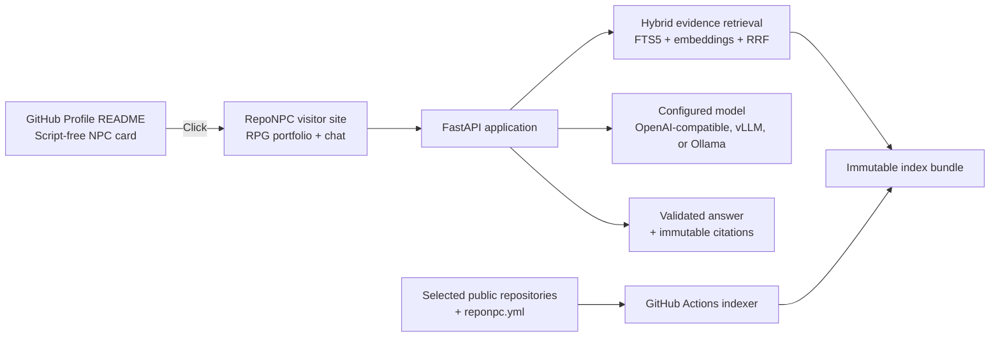

# RepoNPC

> Meet the NPC who knows your code.

RepoNPC is an open-source, self-hosted AI developer portfolio. It turns owner-selected public GitHub repositories and explicit owner claims into a searchable knowledge base, presents them through a pixel-art RPG character, and answers visitor questions with verifiable links to exact GitHub commits and line ranges.

中文定位：讓懂你程式碼的 NPC，替作品說話。

## Project status

RepoNPC completed initial specification approval on 2026-08-10. Delivery Phases 1 through 4 and the 0.1.4–0.1.9 amendments have substantial local automated evidence: guided onboarding, the vLLM preset, external embedding profiles, GitHub OAuth Web Flow with PKCE, bounded exact-archive resolution, durable guided-analysis batches, and actionable OAuth setup guidance. A 2026-08-30 UX/engineering review strengthened the no-dead-end requirements but found application and deployment regressions that are not yet fixed or release-verified. Phase 5 remains the release-hardening boundary; external/manual evidence and the remediation plan are incomplete, so RepoNPC v1 is not complete.

| Item | State |
| --- | --- |
| Product scope | Complete v1 defined; not a reduced MVP |
| Technical specification | Approved 0.1.9; external embedding/private-admin/local-recovery/CLI amendments approved 2026-08-30 |
| Application code | Phases 1–4 and D–E have substantial local automated evidence, but the later P0 UX/deployment/contract regressions remain open; Phase 5 is the active release-hardening boundary |
| License target | MIT |
| Original planning estimate | 8–12 weeks for one developer; not a current remaining-work estimate |

## What v1 will deliver

- A linked pixel-art NPC card for a GitHub Profile README.
- A full external RPG-style visitor page with idle, walk, listen, think, talk, success, and offline character states.
- Traditional Chinese and English visitor/admin interfaces and materially equivalent answers.
- Owner-curated indexing of public GitHub repositories at exact commits.
- Owner assertions, repository facts, and visibly labeled model inferences.
- SQLite FTS5 lexical search, multilingual embeddings, and RRF hybrid retrieval.
- Tree-sitter parsing for Python, JavaScript/TypeScript, Go, and Rust, plus bounded text fallback.
- Answers backed by server-validated immutable GitHub citations and safe abstention when evidence is insufficient.
- Explicit generic OpenAI-compatible, vLLM, and Ollama chat/embedding provider choices with no silent cloud fallback; at least one external embedding profile is required and only one is active at a time.
- A provider-aware embedding model center: Ollama supports curated native pull/delete, while vLLM and generic APIs are connect/probe-only; arbitrary model URLs and local paths are never downloaded by RepoNPC.
- A single-owner admin UI for configuration, character preview, README snippets, and conflict-safe GitHub writeback.
- A guided owner journey that lets the owner choose projects, describe and confirm personal work, preview early, and copy/download locally. GitHub/model analysis is an optional suggestion path; GraphQL, immutable-archive, batch, cache, and scheduler details stay out of the primary task flow.
- A host-authorized first-owner flow: run `reponpc admin setup-code`, then create the local administrator username/password in `/admin`; GitHub OAuth can be linked afterward as an alternative sign-in/public-read connection. There is no product default credential, and the local password remains break-glass recovery. If OAuth is not configured, the GitHub entry point opens a host-side setup guide with the canonical callback URL instead of blocking the user.
- Built-in character customization plus a documented custom sprite-sheet format.
- Immutable GitHub Actions index bundles, atomic activation, pin/rollback, and last-known-good recovery.
- Docker Compose self-hosting, security/cost controls, accessibility, tests, evaluation, and operations guidance.

## Product shape

The README and application are separate by design: GitHub Profile READMEs can render links and images but cannot run the JavaScript required for interactive chat. The SVG/GIF is therefore a safe visual entry point; the external HTTPS site provides the actual application.

## Trust model

RepoNPC never treats repository presence as proof of personal contribution:

- `OWNER_ASSERTION` — a role, achievement, responsibility, or context explicitly written by the portfolio owner;
- `REPOSITORY_FACT` — code, documentation, configuration, dependency, or metadata observable at an indexed commit;
- `MODEL_INFERENCE` — a conclusion that must name supporting assertion/fact evidence and remain labeled as inference.

Repository/configuration text and model output are untrusted. The model has no tools, shell, code execution, filesystem, repository-write, or arbitrary network access. It emits evidence IDs only; the backend validates those IDs and constructs GitHub links.

## Documentation for implementation Agents

Read in this order:

1. [Project context](docs/PROJECT_CONTEXT.md) — problem, users, journeys, goals, boundaries, vocabulary.
2. [Owner review](docs/OWNER_REVIEW.md) — the accepted implementation-level defaults and approval record.
3. [Technical specification](docs/TECHNICAL_SPEC.md) — normative requirements, contracts, schemas, security, and edge cases.
4. [Acceptance criteria](docs/ACCEPTANCE_CRITERIA.md) — Given/When/Then evidence required for every FR/NFR.
5. [Architecture decisions](docs/DECISIONS.md) — proposed decisions and their consequences.
6. [Security model](docs/SECURITY.md) — trust boundaries, threats, secrets, browser/admin/bundle controls.
7. [Implementation plan](docs/IMPLEMENTATION_PLAN.md) — dependency order, milestones, deliverables, and gates.
8. [Delivery phases](docs/DELIVERY_PHASES.md) — the owner-approved MVP-first sequencing of the complete v1.
9. [UX/specification review](docs/UX_SPEC_REVIEW.md) — verified workflow defects, over-design findings, corrected journey, and open UX decisions.
10. [Specification and engineering remediation plan](docs/SPEC_AND_ENGINEERING_REMEDIATION_PLAN.md) — P0/P1/P2 fixes, owners, gates, and unresolved engineering decisions.
11. [Subagent execution playbook](docs/SUBAGENT_EXECUTION_PLAYBOOK.md) — Main/worker ownership, per-phase work packages, gates, handoffs, and evaluator evidence.
12. [Archived P2-00 handoff](docs/P2_FOUNDATION_HANDOFF.md) — historical foundation takeover steps, evidence tracker, and reviewer checkpoints.
13. [Phase 4 handoff](docs/P4_OWNER_ASSETS_PUBLICATION_HANDOFF.md) — owner/admin/assets/publication outcomes, evidence, and remaining release checks.
14. [Operations](docs/OPERATIONS.md) and [sprite format](docs/SPRITE_FORMAT.md) — draft release operations and the canonical character asset contract.
15. [Agent instructions](AGENTS.md) — scope, escalation, invariants, verification, and reporting rules.
16. [`reponpc.example.yml`](reponpc.example.yml) and [`.env.example`](.env.example) — public configuration and deployment boundary.

The sprite contract describes the implemented asset behavior. The operations guide remains Draft: several recovery CLI examples are release requirements rather than currently verified commands, and Phase 5 must complete clean-host, backup/restore, provider, browser, accessibility, and manual release checks.

If these documents conflict, follow the source-of-truth order in `PROJECT_CONTEXT.md`. Application code must remain within the approved specification and its owner-approved changes.

## Planned stack

- Web: React, Vite, TypeScript, pnpm
- Application/indexer: FastAPI, Python, uv
- Search: SQLite FTS5, NumPy vector ranking, RRF
- Parsing: Tree-sitter
- Models: external Ollama/vLLM/OpenAI-compatible chat and embedding profiles; the local sentence-transformers adapter is benchmark/build-fixture-only and is not a production default
- Automation/artifacts: GitHub Actions, GitHub Releases, stable index manifest
- Deployment: one application image through Docker Compose
- Runtime state: persistent SQLite separate from immutable index SQLite

## Configuration model

Public, version-controlled portfolio content lives in `reponpc.yml`: profile, localized copy, selected repositories, owner claims, character, card, and retrieval settings. Deployment secrets and private provider details stay in environment variables or mounted secret files. The admin UI writes only `reponpc.yml` and validated PNG files below `assets/character/` using GitHub blob-SHA conflict protection.

On a fresh deployment, configure the IP-HMAC key and one external embedding provider (the recommended starter is Ollama `qwen3-embedding:0.6b`), start RepoNPC, run `docker compose exec app reponpc admin setup-code`, and enter the one-time code at `/admin` through loopback/SSH/VPN. The code expires after 15 minutes and only its SHA-256 digest is stored. Create the local password first; GitHub OAuth is optional and can be linked afterward.

For local Windows evaluation, double-click `start-reponpc.cmd`. The launcher builds stale Web assets, creates an ignored local IP-HMAC key when needed, starts FastAPI in the background, waits for `/healthz`, restarts only a stale process previously owned by this launcher, refuses to terminate unknown processes using the port, prints a fresh first-owner setup code only while setup is still open, and opens `http://localhost:8090/admin` by default. It never creates a default username/password and does not require a GitHub token. Local logs and runtime state stay below the ignored `runtime-data/local/` directory. Use `-Port` or `REPONPC_PORT` to override the local port. This convenience launcher is not a replacement for the supported Docker/HTTPS production deployment described in `docs/OPERATIONS.md`.

## v1 boundaries

One owner, selected public repositories, and one NPC per deployment. Private repository indexing, multi-tenant SaaS, billing, visitor accounts, OAuth device flow, autonomous code tools, multiple NPCs, and a navigable RPG game are intentionally outside v1.

## Name

**RepoNPC** combines repository knowledge with the RPG character representing the developer:

> Your repositories are the world. Your work is the lore. Your NPC knows the evidence.
