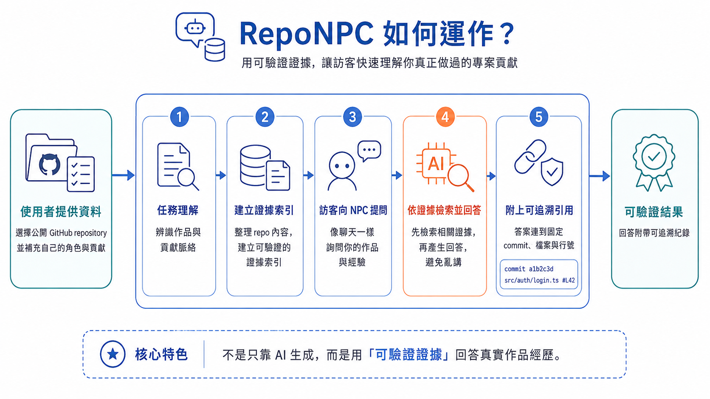

# RepoNPC

> Meet the NPC who knows your code.<br>
> 讓懂你程式碼的 NPC，替你介紹作品。

RepoNPC 是一個開源、自託管的互動式 GitHub 作品集。你挑選想展示的公開儲存庫，補上自己確認過的角色與貢獻，RepoNPC 就會把它們整理成一個能回答訪客問題的像素 RPG 角色。

回答不只「聽起來合理」：重要內容會連回固定 commit、檔案與行號，讓訪客可以直接核對原始證據。

> [!IMPORTANT]
> RepoNPC 0.2.1 已完成 GitHub OAuth／公開讀取 PAT 退場與匿名 REST resolver；clean-host Docker、真實 provider、完整瀏覽器與無障礙驗證仍待執行，因此目前適合開發與評估，尚非正式 v1 發布版。
> Phase 5 remains the release-hardening boundary.

最後檢閱：2026-09-10

模型連線、回答模型與資料查找模型（技術上為 embedding model）的服務管理、測試與模型優先設定引導已整合至目前 working tree。**規格 0.2.3 / ADR-030** 已核准改為「先設定兩種模型，再選專案並分析」，同時保留立即手動建立作品集的路線。管理員專案分析可在正式索引發布前執行；訪客問答仍需通過正式 bundle 驗證與啟用。修正交接請讀 [模型優先引導實作交接](docs/ONBOARDING_FLOW_IMPLEMENTATION_HANDOFF.md)，前一版連線／秘密設計見 [模型設定實作交接](docs/MODEL_SETUP_IMPLEMENTATION_HANDOFF.md)。Figma 暫不處理；GGUF／Hugging Face 本地 runtime 仍是後續研究。

## 30 秒了解 RepoNPC

一般 GitHub Profile 告訴訪客「有哪些 repository」，卻常常無法快速回答：

- 這些專案解決了什麼問題？
- 為什麼採用這個架構？
- 作品擁有者實際負責了什麼？
- 哪一段程式碼可以證明這項說法？

RepoNPC 把這些資訊變成一段可對話、可驗證的作品集體驗：

[](reponpc-how-it-works.png)

最後你會得到兩個入口：

1. 放在 GitHub Profile README 的靜態 NPC 卡片。
2. 一個真正提供作品瀏覽、雙語問答與引用連結的 RepoNPC 網站。

GitHub README 不允許執行互動式 JavaScript，所以卡片負責吸引訪客並連到網站；聊天功能則在你自己架設的 RepoNPC 服務中執行。

## 它和一般 AI 聊天機器人有什麼不同？

RepoNPC 不讓模型自由搜尋、執行程式或自行拼湊 GitHub 連結。它先由後端找出允許使用的證據，再讓模型以證據 ID 回答，最後由後端驗證並產生引用。

系統也會分清楚三種內容：

| 類型 | 白話說明 |
| --- | --- |
| `OWNER_ASSERTION` | 你親自確認的角色、責任、成果或背景。 |
| `REPOSITORY_FACT` | 從指定 commit 的程式碼、文件或公開 metadata 直接看到的事實。 |
| `MODEL_INFERENCE` | 模型根據證據做出的推論，必須明確標示為推論。 |

「repository 裡有這段程式碼」不等於「你一定親自完成這段程式碼」。如果證據不足，RepoNPC 應該說明無法判定，而不是猜測。

## 主要功能

- 像素 RPG 風格的作品集網站與 GitHub Profile 卡片。
- 繁體中文（`zh-TW`）與英文（`en`）訪客／管理介面。
- 關鍵字搜尋、向量搜尋與 RRF 組成的混合檢索。
- 固定到 exact commit、檔案和行號的 GitHub 引用。
- Ollama、vLLM 與通用 OpenAI-compatible 聊天／embedding 服務。
- 引導式 repository 選擇、貢獻撰寫、預覽與設定匯出。
- 單一擁有者管理介面：本機啟動免註冊／免密碼，遠端部署保留密碼；公開 repository 的讀取不要求 OAuth 或 PAT。
- 內建角色組合器與自訂 sprite sheet。
- 不可變索引包、校驗、原子切換、保留上一個可用版本與 rollback。

## 建立前需要準備什麼？

要看到管理介面，Windows 本機評估只需要開發工具與一個可連線的模型服務。要建立可公開使用的完整作品集，則還需要 GitHub 發布與正式部署環境。

| 用途 | 需要準備 |
| --- | --- |
| Windows 本機評估 | Git、PowerShell、[uv](https://docs.astral.sh/uv/)、Node.js 24／Corepack，以及正在執行的 Ollama 或其他已設定 provider。 |
| 完整作品集 | 一個公開 GitHub 帳號、你要展示的公開 repositories、`reponpc.yml`、聊天 provider，以及至少一個外部 embedding provider。 |
| 正式部署 | x86_64 Linux、Docker Engine、Compose v2、持久化磁碟、公開網域、HTTPS reverse proxy，以及你在部署 repository 維護的 GitHub Actions／Releases。參考主機為 4 CPU、8 GB RAM，另加模型所需資源。 |

RepoNPC 的 Compose 檔只啟動應用程式，不會順便啟動 Ollama 或 vLLM。模型服務必須由你另外部署，而且必須能從 `app` container 連線。

## 最快試跑：Windows 本機評估

這條路徑用來看看管理介面與設定流程，不代表完整的 production 部署。

1. 下載專案：

   ```powershell
   git clone https://github.com/xu-0306/RepoNPC.git
   Set-Location RepoNPC
   ```

2. 如果使用 Ollama，先啟動 Ollama 並準備聊天與 embedding 模型：

   ```powershell
   ollama pull qwen3.5:9b
   ollama pull qwen3-embedding:0.6b
   ```

3. 啟動 RepoNPC：

   ```powershell
   .\start-reponpc.cmd
   ```

啟動器會在需要時安裝鎖定的 Python／Web 依賴、建立前端、只監聽 `localhost:8090`，並以兩分鐘、僅能使用一次的本機授權開啟 `/admin`。瀏覽器會把它交換成受保護的管理 session 並立即清除網址片段，因此本機評估不需要註冊、帳號、密碼或 GitHub OAuth。若直接開啟 `/admin` 而沒有有效 session，重新執行啟動器即可。

如果你已建立 `.env`，本機 provider URL 必須能從 Windows 主機連線，例如 Ollama 通常是 `http://127.0.0.1:11434`。完整訪客問答仍需要一個已發布並啟用、且 embedding 身分相符的索引包。

## 建立自己的 RepoNPC

完整流程可以理解成五個階段。

### 1. 寫下你想展示的內容

先複製公開設定範例：

```bash
cp reponpc.example.yml reponpc.yml
```

編輯 `reponpc.yml` 中最重要的四個部分：

- `profile`：你的名稱、簡介、連結、招呼語與建議問題。
- `repositories`：只加入你明確選擇的公開 repository。
- `role`、`summary`、`claims`：寫下你願意公開並親自確認的貢獻。
- `character` 與 `card`：選擇 NPC 外觀和 README 卡片樣式。

`reponpc.yml` 預期會公開，請勿放入 token、API key、密碼、內部 URL 或私人 repository 名稱。

### 2. 設定聊天與 embedding 服務

RepoNPC 將聊天模型與 embedding 模型視為兩個獨立能力。兩者可以來自同一台 Ollama，也可以分別使用 vLLM 或 OpenAI-compatible API。

選擇 Ollama 後，可參考 `qwen3-embedding:0.6b` 等模型；它不是規格 0.2.2/0.2.3 的預設服務或預選模型。正式環境仍使用外部 embedding profile；內建 sentence-transformers adapter 只供隔離測試與 benchmark。管理頁已有連線／模型面板，但一般引導與乾淨啟動後的首次分析仍在修正，因此目前可使用明確環境設定或進階管理面板評估，不能把引導畫面視為完成的首次使用流程。

先建立部署環境檔與 secret 目錄：

```bash
cp .env.example .env
mkdir -p secrets
openssl rand -base64 48 > secrets/reponpc_ip_hash_key
chmod 700 secrets
chmod 600 secrets/reponpc_ip_hash_key
```

接著至少修改 `.env` 中這些設定：

- `REPONPC_PUBLIC_BASE_URL`、`REPONPC_TRUSTED_HOSTS`
- `REPONPC_CONFIG_REPOSITORY`、`REPONPC_INDEX_MANIFEST_URL`
- `REPONPC_CHAT_PROVIDER`、`REPONPC_CHAT_BASE_URL`、`REPONPC_CHAT_MODEL`
- `REPONPC_EMBEDDING_PROVIDER`、`REPONPC_EMBEDDING_BASE_URL`、`REPONPC_EMBEDDING_MODEL`

正式 secret 建議寫入 `secrets/` 中的獨立檔案，再使用對應的 `*_FILE` 環境變數掛載；不要把真實 secret 提交到 Git。

### 3. 驗證設定並建立索引

在已安裝 [uv](https://docs.astral.sh/uv/) 的 source checkout 中：

```bash
uv sync --frozen
uv run reponpc config validate reponpc.yml
uv run reponpc index build --config reponpc.yml --output dist
```

索引建立器會把選定的 branch、tag 或 ref 解析成 exact commit，套用檔案與大小限制，產生證據、公開 profile、角色資產與 README 卡片，再建立不可變 bundle。

索引所使用的 embedding provider、模型、維度與前綴必須和 runtime 完全一致，否則 bundle 不會啟用。

### 4. 發布索引並啟動網站

建議在自己的部署 repository 建立 GitHub Actions workflow，驗證並發布 bundle 到 GitHub Release；確認資產可讀與 checksum 正確後，最後才更新 `stable-manifest.json`。公開 source 不附帶 `.github/workflows/`，手動執行相同兩階段發布的命令為：

```bash
uv run reponpc index publish --bundle-dir dist
uv run reponpc index publish-manifest --bundle-dir dist
```

這兩個命令需要先依 [操作手冊](docs/OPERATIONS.md) 設好 GitHub repository、權限與發布環境。不要覆寫既有 release asset，也不要在 bundle 尚未驗證前更新 stable manifest。

有可用 manifest 後，在正式 Linux 主機啟動應用程式：

```bash
docker compose build --pull
docker compose up -d
docker compose ps
```

檢查服務：

```bash
curl --fail http://127.0.0.1:8000/healthz
curl --fail http://127.0.0.1:8000/readyz
curl --fail http://127.0.0.1:8000/api/public/status
```

`healthz` 只表示程序有回應；`readyz` 成功才代表索引、runtime 與模型已相容並可服務。

### 5. 進入管理介面並分享卡片

本機 Windows 評估只要執行啟動器；它會自動簽發短效本機授權並直接開啟管理介面。以下 setup code 僅供 `production` 或任何非 loopback 的管理部署使用：

```bash
docker compose exec app reponpc admin setup-code
```

透過 loopback、SSH tunnel、私人 LAN 或 VPN 開啟 `/admin`，輸入 setup code，再建立本機帳號與密碼。正式環境的密碼至少 15 個 Unicode 字元。GitHub 公開 repository 分析使用匿名 REST 容量；OAuth 與瀏覽器輸入的公開讀取 PAT 已退場。

管理介面確認 index 與 provider 都 ready 後，即可預覽 NPC、產生 README Markdown，並貼到你的 GitHub Profile README。

> [!WARNING]
> 不要把 `/admin` 或 `/api/admin/*` 直接公開到 Internet。特殊或高編號 port 不是安全控制；正式環境應由 reverse proxy 只公開訪客路由，並把管理路由限制在私人網路。

完整的 HTTPS、GitHub 寫回權限、匿名讀取額度、備份、更新、rollback 與故障排除方式請參閱 [操作手冊](docs/OPERATIONS.md)。

## 常見疑問

### 一定要使用雲端 AI 嗎？

不用。你可以使用私人 Ollama 或 vLLM，也可以使用通用 OpenAI-compatible API。RepoNPC 不會在 provider 故障時偷偷切換到另一個服務。

### RepoNPC 會掃描我所有 GitHub repository 嗎？

不會。只有你明確選擇並確認的公開 repositories 會進入分析／索引範圍。v1 不支援私人 repository。

### 模型可以修改我的程式碼嗎？

不可以。LLM 沒有 shell、工具、檔案系統、repository 寫入或任意網路能力。GitHub 設定回寫由後端以獨立權限和衝突檢查處理。

### GitHub 匿名讀取額度或模型不可用時，還能編輯作品集嗎？

可以。你仍可手動輸入貢獻、驗證、預覽、複製或下載 YAML。模型分析是可選的建議功能，GitHub writeback 也不是本機編輯的必要條件；匿名 GitHub REST 達到限制時只需稍後重試分析。

### 更新索引失敗會讓網站壞掉嗎？

不應該。新 bundle 必須先通過 checksum、schema、模型相容性、SQLite 完整性與 smoke checks；失敗時會保留上一個可用版本。

## 文件導覽

| 想了解… | 請閱讀 |
| --- | --- |
| 完整安裝、HTTPS、備份、恢復與 rollback | [操作手冊](docs/OPERATIONS.md) |
| API、資料結構與功能契約 | [技術規格](docs/TECHNICAL_SPEC.md) |
| 先設定模型再分析的引導修正 | [模型優先引導實作交接](docs/ONBOARDING_FLOW_IMPLEMENTATION_HANDOFF.md) |
| 中立模型設定、API 金鑰安全與前置引導改版 | [實作交接](docs/MODEL_SETUP_IMPLEMENTATION_HANDOFF.md) |
| 每項需求如何判定完成 | [驗收標準](docs/ACCEPTANCE_CRITERIA.md) |
| 威脅、秘密管理與管理介面限制 | [安全模型](docs/SECURITY.md) |
| 重要架構選擇及其理由 | [架構決策](docs/DECISIONS.md) |
| 自訂 NPC 圖片格式 | [Sprite 格式](docs/SPRITE_FORMAT.md) |

要修改程式碼前，請先閱讀技術規格、驗收標準、安全模型與架構決策。公開文件發生衝突時，以已批准的技術規格與明確記錄的架構決策為準。

## 技術棧

- Web：React、Vite、TypeScript、pnpm
- API／indexer：FastAPI、Python、uv
- 搜尋：SQLite FTS5、NumPy、向量檢索、RRF
- 程式碼解析：Tree-sitter（Python、JavaScript／TypeScript、Go、Rust）
- 模型：Ollama、vLLM、OpenAI-compatible chat／embedding profiles
- 發布：GitHub Actions、GitHub Releases、stable manifest
- 部署：單一 RepoNPC application image、Docker Compose、持久化 SQLite

## v1 刻意不做的事

RepoNPC v1 是單一擁有者、單一 NPC，只處理擁有者選定的公開 repositories。它不是多租戶 SaaS、通用 coding agent 或完整 RPG 遊戲，也不包含私人 repository、billing、訪客帳號、OAuth device flow、多個 NPC 或可自由探索的遊戲世界。

## 參與開發

目前專案仍在 Phase 5 發布強化階段。請先閱讀受影響的規格，再使用鎖定的工具鏈安裝依賴：

```bash
uv sync --frozen
corepack enable
pnpm install --frozen-lockfile
```

常用檢查：

```bash
uv run ruff format --check .
uv run ruff check .
uv run mypy src
uv run pytest
pnpm run web:check
```

每一項行為變更都必須補上相應測試，並同步更新受影響的規格、範例與驗收證據。

## 授權

`pyproject.toml` 目前宣告為 MIT。正式對外發布前仍應以 repository 根目錄中的 `LICENSE` 檔案為準。

## 新手模型設定修復（2026-09-12）

模型設定的操作順序為「新增服務 → 新增模型 → 測試模型 → 確認用於分析」。已有服務可直接新增模型；資料查找模型的維度留空即可，測試成功時才自動取得。測試不會自動啟用公開網站。失敗卡片顯示 HTTP 狀態或明確的逾時／連線說明，並保留設定供編輯或重試。

只改服務名稱時保留原網址與金鑰；更換網址是獨立選項。新輸入的金鑰會在送出或收合表單後清除。舊的泛用錯誤沒有保留原 HTTP 狀態，須再按一次測試才有新診斷。

此次資料庫升級包含 runtime migration 19 與後續 migration 20，首次載入新版後端時交易式升級。保留舊資料與模型選擇，失敗會回復；正式 bundle 格式不變。完整修復清單與證據見 [UI／UX 修復紀錄](docs/UI_UX_REVIEW_2026-09-12.md)。

模型測試失敗會顯示實際 HTTP 狀態碼與服務商錯誤原文，不翻譯或推測原因。原文會遮蔽已知金鑰及私人網址，並限制長度；無可顯示文字時會明確提示。舊版本未保存的原文需按「測試模型」重新取得。詳見 [錯誤原文修正紀錄](docs/PROVIDER_ERROR_MESSAGES_2026-09-12.md)。
