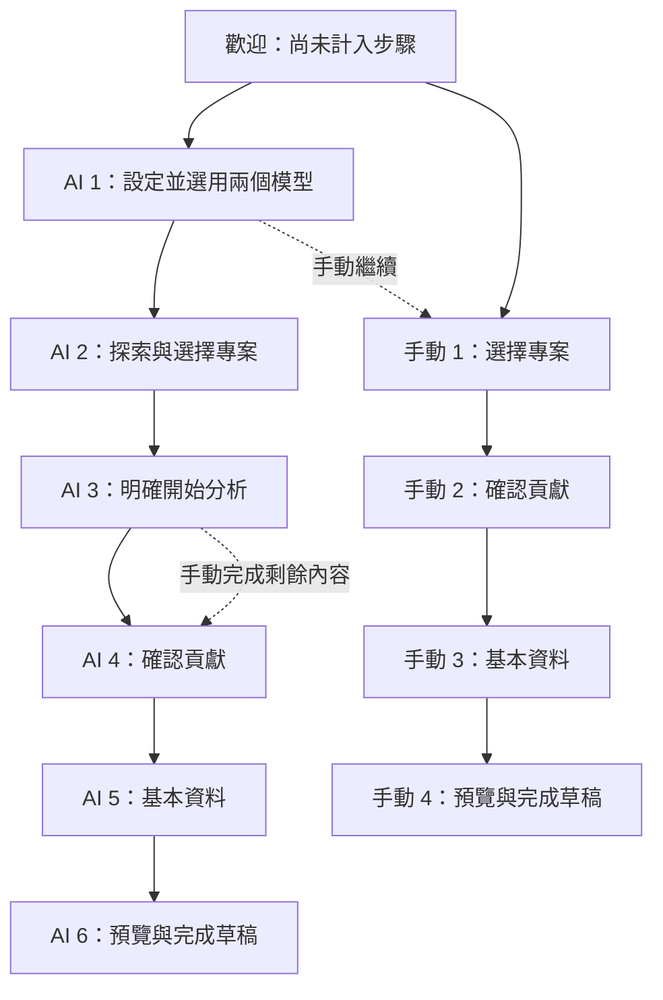

# RepoNPC 管理工作區 UI 改善計劃

2026-09-12 完整引導修正：拒絕建議明確要求重新填寫並確認，合併重複的貢獻確認操作；專案進階選項與多專案貢獻以原生 details 控制長度。基本資料列出具名缺漏欄位及定位連結；檢閱呈現雙語角色、摘要與逐項宣告。步驟切換會定位標題，模型頁提示先測試與確認選用，完成頁區分草稿與發布並提供剪貼簿成功／失敗回饋。共用 checkbox 尺寸、主要操作樣式與手機模型區順序一併修正。未新增 UI 套件、發布流程、持久化格式或放寬確認條件。

本次驗證：web:check 通過，14 個測試檔共 84 項測試；瀏覽器 fixture 檢查專案 checkbox、進階選項收合、375px 無水平溢位、缺漏欄位 DOM 操作後焦點、雙語宣告及返回後標題焦點。自動化實體滑鼠／鍵盤觸發缺漏連結未取得穩定結果，因此不宣稱完整鍵盤或滑鼠驗收；真實 provider、發布與完整 AC 驗收仍需另行驗證。

2026-09-12 互動修正：回答模型、資料查找模型及服務新增表單預設收起，透過具鍵盤操作的展開入口開啟。模型卡片保留測試按鈕並顯示待測試／可選用／失敗狀態；服務詳細資訊及 Ollama 安裝清單按需展開。儲存成功才收起表單，失敗保留輸入；回答模型與服務的編輯操作會開啟表單，取消後重設。瀏覽器 fixture 已驗證新增失敗、重試成功、卡片出現、編輯與取消，以及五種視窗寬度；此結果不代表 live provider 或完整 AC 驗收完成。

日期：2026-09-11；依 2026-09-10 的程式審核基線整理。狀態：**U1 工作區外框與 U2 模型任務頁的第一個 UI 工作包已實作；U3 路線恢復與 U4 完整整合驗收仍待後續工作。**

本次 UI 工作包新增安全狀態摘要、AI／manual 對應步驟列、管理頁雙語工具列，以及三欄模型設定組合；模型輸入維持空白起始，已保存 URL／key 不回填。依 2026-09-12 owner 回饋，引導頁提供具名確認的「刪除設定」，不提供公開啟用或 Ollama 檔案卸載操作；active／重建索引限制與後端引用保護維持不變。環境連線明示只是啟動設定，不表示內建、安裝或可用服務，需從環境設定修改或移除。元件測試與 deterministic browser fixture 已覆蓋 1440、1024、768、375、320 CSS px；live provider、clean-host、contextual return 與完整 AC-057／058／060 證據尚未因此標記完成。

管理頁使用固定版本的 `@lobehub/icons-static-svg` 提供 Ollama、OpenAI、Qwen 與 vLLM 品牌識別；SVG 由 Vite 隨程式打包，不從 CDN 載入。授權與商標用途記錄於 repository 根目錄的 `THIRD_PARTY_NOTICES.md`。

目標是讓管理者看得懂「目前做到哪裡、還缺什麼、接下來按哪裡」，並沿用參考圖的白底、紫色重點、卡片、六步導覽與像素 NPC。行為以 Approved Technical Specification 0.2.5 為準；本文件不新增 provider、發布拓撲或公開資料 schema。依 ADR-032，服務有效設定更新後，可安全修改的關聯模型會自動換到新 revision、清除舊測試證據並刷新卡片；使用者只需重新測試，不需再編輯儲存模型。

審核基線及必修缺陷見 [模型與引導實作審核](MODEL_ONBOARDING_IMPLEMENTATION_REVIEW_2026-09-10.md)。參考圖為擁有者提供的 `ChatGPT Image 2026年9月10日 下午11_40_18.png`，屬於期望視覺，不是目前功能已實現的證據。

## 1. 保留的設計方向與需要修正的語意

| 參考圖元素 | 設計處理 | 原因 |
| --- | --- | --- |
| 深藍標題、白色卡片、紫色互動、淡紫提示 | 保留；降低邊框與陰影數量，統一對齊和間距 | 建立一致的工作區層次 |
| NPC 加短對話泡泡 | 保留；用既有合法角色素材，提供每步一則簡短提示 | 品牌感不應擠壓表單或取代文字說明 |
| 頂部五張狀態卡 | 保留視覺節奏，內容改為進度／專案／分析與回答／搜尋／公開網站 | 參考圖把搜尋與 embedding 重複列為兩個能力 |
| 六步 stepper | AI 路線維持六步；welcome 不計步，manual 只計四步 | 符合 FR-041，跳過的 AI 工作不顯示完成 |
| 主區左中右三欄 | 寬桌面採角色選擇／連線／模型庫；後兩者依操作展開 | 初次使用不必同時理解全部管理細節 |
| 三個面板標題各有 1/2/3 | 改為角色圖示及功能標題，只讓 stepper 表示步序 | 避免把同一個第 1 步誤認成另三步 |
| 儲存過的完整 API URL、key 狀態 | saved card 只顯示安全名稱、provider、位址是否已設定、key 是否已設定 | URL/key write-only；不能為了照圖增加 secret read endpoint |
| 預選 Ollama/qwen、綠色「已設定」 | 新部署為明確空狀態；依真實測試／選用結果顯示狀態 | 範例不是 runtime 選擇，儲存不等於可用 |
| Embedding 維度、reference、raw status | 移至「技術資訊」；未測量維度顯示未知 | 不要求新手理解 dimension/prefix；不填假 1024 |
| 停用／刪除與主要操作同樣醒目 | 卡片保留次要「刪除設定」入口與具名確認；公開啟用、實體卸載留在進階管理 | 保留基本管理能力，避免設定刪除與實體卸載混淆 |
| 底部「儲存設定」與「下一步」 | 依當前任務明確命名，不使用同名總儲存控制多種資料 | 連線儲存、分析選用、草稿、GitHub save 與 publish 是不同操作 |

## 2. 資訊架構

### 2.1 共用工作區外框

畫面由 header、狀態摘要、路線導覽、主內容、操作列組成。登入／local-launch recovery 保留既有授權流程，僅共用合適的視覺樣式。

Header 左側為 `RepoNPC 管理工作區` 與一句任務說明；右側為語言切換、使用說明、帳戶／登出。只使用現有安全 owner 資料；沒有姓名時使用「管理員」，不假造 avatar、角色或個人資訊。NPC 在桌面占小範圍，手機可放入說明區；不增加外部追蹤、CDN 字體或未批准服務。

| 摘要卡 | 顯示內容與來源 | 點擊結果 |
| --- | --- | --- |
| 設定進度 | 路線與已完成適用步數；進入 AI 第一步時為完成 0/6、目前第 1 步 | 展開可存取步驟列表，不跳過必要條件 |
| 已選專案 | 目前公開草稿已選 repository 數、是否已確認 | 返回專案選擇；保留未受影響資料 |
| 分析與回答模型 | analysis-selection 的安全模型名、connection label、測試／選用狀態 | 開啟此角色設定並記住返回位置 |
| 資料查找模型 | 同一個 embedding 能力的安全選用狀態 | 開啟資料查找角色設定並記住返回位置 |
| 公開網站 | 已驗證 bundle／public status；無索引時顯示尚未就緒 | 顯示發布條件與既有管理入口 |

摘要卡不能自己呼叫 provider health/probe 來決定綠燈；開頁只讀安全 metadata。進度只描述步驟完成，不表示剩餘工時或生成完成率。模型名稱和 connection label 應允許換行，辨識不可只依靠模型名。

### 2.2 主路線



從其他步驟開模型設定屬於 contextual edit：記錄 `returnStep`、來源控制與受影響角色；完成或取消回到原工作位置，不自動跳 repository、不自動送分析、不消除 manual 的已完成資料。這是 view/state 設計名稱，非新增 wire-contract 欄位。

### 2.3 桌面模型頁示意

```text
RepoNPC 管理工作區       [NPC 短提示]        [語言] [說明] [管理員]
[完成 0/6] [已選專案 0] [分析：未選用] [搜尋：未選用] [公開：未就緒]
① 設定 AI 模型 — ② 探索與選擇 — ③ 分析 — ④ 確認貢獻 — ⑤ 基本資料 — ⑥ 預覽

┌ ① 選擇分析模型     ┐ ┌ ② 分析與回答模型       ┐ ┌ ③ 資料查找模型      ┐
│ [回答模型]         │ │ 1. 選擇／新增服務      │ │ 1. 選擇／新增服務   │
│ [資料查找模型]     │ │ Provider／API／Key     │ │ Provider／API／Key  │
│ 狀態＋下一個動作   │ │ 2. 輸入模型名稱並測試  │ │ 2. 輸入模型並測試   │
│ [確認用於分析]     │ │ 已建模型／測試結果     │ │ 已建模型／測試結果  │
│                    │ │ [技術資訊 ▸]           │ │ [技術資訊 ▸]        │
└────────────────────┘ └────────────────────────┘ └─────────────────────┘
[返回] [先手動建立]                     已選用 0/2  [下一步：探索與選擇]
```

這三欄是同一個模型設定任務的閱讀順序。左欄只選擇已測試模型；中央與右欄各自完整容納一種用途的服務、API、模型與測試流程，不以 role tab 隱藏另一種設定，也不把 connection/profile 的內部資料分層當成頁面資訊架構。已有有效 selection 時，以摘要為主，不強迫重填或重測。

此分組遵循 [Carbon form pattern](https://carbondesignsystem.com/patterns/forms-pattern/) 將相關任務放在同一區塊、依可預期順序排列並漸進揭露額外欄位的原則；也參考 [GOV.UK question pages](https://design-system.service.gov.uk/patterns/question-pages/) 聚焦單一問題與避免重複輸入的做法。模型領域上，[Dify model provider documentation](https://docs.dify.ai/en/develop-plugin/dev-guides-and-walkthroughs/creating-new-model-provider) 明確區分 provider credentials 與 model-specific configuration；RepoNPC 保留這個安全資料邊界，但不將它直接映射成首次設定頁的兩個分離工作區。

## 3. 模型設定互動

### 3.1 初次設定

1. 分析與回答、資料查找兩個設定區塊同時可見；各區塊依序完成服務與模型，不要求使用者先切換角色或理解 connection/profile 名詞。
2. 每個用途先明確選已有服務或新增服務；服務選項為現有 Ollama、OpenAI-compatible、vLLM preset，初始空白。owner-managed 服務可明確共用，host-managed chat/embedding 只出現在對應用途。
3. 新服務表單依序為名稱、服務、API 位址、可選 API key；同區塊緊接模型服務選擇與模型名稱。placeholder 只作例子，不當作送出值。
4. 「儲存連線」僅儲存候選服務，畫面以編號與連續區塊引導使用者接著建立模型。「測試模型」是另外的明確動作，以當前用途實際 capability probe 為準。
5. 成功後顯示模型、安全服務名稱、已驗證用途與下一步。先建立本地待選 pair，只有按「確認用於分析」才提交目前 API 所需的兩個 profile IDs 與 generation。
6. server 回報兩角色 eligible 後才可「下一步：探索與選擇」。模型已測但未選用要明說，不能只用綠色勾號。

目前 selection API 提交的是一組 pair；UI 可逐一編輯兩角色，但不能假設已有獨立的單角色 selection endpoint。若後端尚缺能力，顯示真實缺口，不以 local boolean 偽裝完成。

「測試連線」若只證明網路／listing 可達，就只能顯示該結果，不能取代「測試分析能力」或「測試搜尋能力」。沒有受定稿契約支援的 connection test endpoint 時，不加一顆無實際作用的測試按鈕。

### 3.2 連線卡與秘密欄位

- 卡片只顯示 display name、provider、source、revision 的友善摘要、`endpoint_configured`、`key_configured`。內部 reference 不佔主要畫面。
- 已保存 URL/key 不回填、不提供「顯示已存 key」、不讀出 masked suffix；眼睛圖示只可切換本次新輸入值。
- 編輯時提供明確「保留／替換／移除憑證」。空白不能被當成刪除。目的地變更依後端規則要求新的授權憑證，不偷偷沿用舊 key。
- 成功、取消、登出、session expiry、unmount 清除秘密輸入。失敗保留安全名稱、角色及模型選擇；不可把 URL/key 送入 draft/storage/log/trace/測試快照。
- host-managed 卡片提供來源說明與編輯／刪除操作。編輯要求完整新網址且不讀回部署環境值，成功後轉為 owner-managed；刪除須先解除模型引用並跨重啟保留停用狀態。
- 新增表單在 owner 動作後展開，使用同一份 editor；不在兩個角色各複製一套會不同步的 connection store。

### 3.3 模型庫

右欄更名「此連線的模型」，搜尋角色可補標 `Embedding`。只展示目前明確選定 connection 的內容，切連線不沿用上一服務清單。

- 只在 listing 已有實作／定稿時提供「讀取模型清單」，明確觸發；404/405/501 可改手動輸入，401/429/timeout 顯示安全原因，不當成空清單。
- Ollama 已有模型可手動輸入，不能被 download catalog 限制；「安裝模型」只出現在已支援的 curated Ollama 管理流程，先呈現目標服務與模型，再由使用者明確開始。
- OpenAI-compatible／vLLM 不顯示安裝、pull、delete 遠端模型的假操作。
- 清楚區分「刪除此設定」和「從 Ollama 移除模型」。對受 active/job 引用的資源，遵循 backend reference guard；不以刪除按鈕繞過它。
- 維度、normalization、prefix、connection revision、raw safe error code 和安裝診斷集中在「技術資訊」。已安裝不代表已測試；測試通過不代表公開索引已完成。

### 3.4 狀態與文案

以下為呈現層狀態，不能新增或修改現有 API error/status 字串來遷就畫面。

| 實際狀況 | 繁中主要文案 | 英文主要文案 | 下一個動作 |
| --- | --- | --- | --- |
| 無 connection/profile | 尚未設定資料查找模型 | Set up a content finder | 設定資料查找模型 |
| 已儲存，未 probe | 已儲存，尚未測試 | Saved; test required | 測試模型 |
| probe 執行中 | 正在測試搜尋能力… | Testing search capability… | 顯示 busy，阻止重複提交 |
| 測試成功，尚未選用 | 測試通過，尚未選用 | Test passed; not selected | 確認用於分析 |
| pair eligible | 已選用，可用於分析 | Selected for analysis | 下一步 |
| 只缺其中一個角色 | 還需要設定資料查找模型 | Content finder still needed | 直接進入缺少的角色 |
| 連線／模型 revision 改變 | 設定已變更，請重新測試並選用 | Settings changed; test and select again | 測試／選用；保留原工作 |
| 選定服務暫時不可用 | 目前無法連線，設定已保留 | Connection unavailable; settings kept | 重試／編輯／手動繼續 |
| 分析可用，但無公開索引 | 分析模型可用；公開搜尋尚未就緒 | Analysis available; public search not ready | 繼續分析；另看發布條件 |
| public reindex_required | 公開搜尋需要重建索引 | Public search index needs rebuilding | 既有明確重建流程 |
| publication-only blocker | 草稿可匯出；發布還需要設定 | Draft can be exported; publishing needs setup | 下載草稿／查看缺少項目 |

每個 disabled button 都要有相鄰可讀原因與修復動作，不能只放 tooltip。成功、警告、錯誤同時用文字與圖示，不能只用顏色。分析 pair 選用不顯示籠統「已啟用」；公開 Chat 啟用、公開索引重建留在各自入口。

## 4. 後續步驟與操作列

| 步驟 | 主操作與資訊 | 必須保留的行為 |
| --- | --- | --- |
| 探索與選擇 | 搜尋／輸入公開專案、checkbox、確認清單 | listing 只有 metadata；未確認不分析；返回可以編輯 |
| 分析 | 選定專案與兩角色摘要、一個 Start、每專案進度與 partial results | Start 才做 preflight/create；lost response 先 reconcile；失敗有 retry/manual；不自動重送 |
| 確認貢獻 | facts／AI inference／owner assertion 分組，清楚確認操作 | 手動無模型可完成；不從 repository 推斷個人職位或成果 |
| 基本資料 | 現有必要雙語欄位，逐欄錯誤 | 不丟原稿；不趁此改 character／asset contract |
| 預覽與完成草稿 | 預覽、驗證、複製／下載，發布條件摘要 | 草稿完成與 GitHub save、dispatch、activation 分開；不能因沒 token 禁止匯出 |

操作列只保留一個當前主動作。模型頁是「下一步：探索與選擇」，分析頁是「開始分析／重新嘗試」，預覽頁是適當的草稿操作。表單內的「儲存連線」屬局部提交，不和頁尾做另一個同名總儲存。

桌面可使用底部 sticky bar；在小視窗、200% zoom 或鍵盤彈出後若會遮擋內容，改成正常文件流。保留足夠底部空間、safe-area 與 scroll-padding；tab 到表單最後一欄時不能被遮住。返回、manual、retry 都不偷偷 cancel active batch；取消批次有自己的明確控制。

## 5. 視覺規則與響應式

以下為設計起點，不是對參考 PNG 的精準色彩取樣；實作時以 computed styles 測對比。

| Token／元素 | 建議 |
| --- | --- |
| 背景／surface | `#F8F7FC`／`#FFFFFF` |
| 主要字／次要字 | `#171642`／`#5E617B`；正常說明不淡化到低對比 |
| 主色／hover／淡色 | `#5138E8`／`#4027C7`／`#F0EDFF` |
| 成功／錯誤字 | `#17643B`／`#B42332`；用淺背景承載，不只一顆色點 |
| 邊框／圓角 | 淡灰紫 border；卡片 12～16 px、表單 8 px |
| 間距 | 4/8/12/16/24/32 px 尺度；卡片內以 20～24 px 起始 |
| 字級 | 桌面頁標 32～36 px、手機 24～28 px；區塊標題 20～24 px；本文／input 16 px；輔助文字 14 px |
| 行高 | 本文約 1.5～1.7；標題至少 1.2，避免現有全域 h1 的 0.98 壓縮繁中 |
| 圖示 | 同一套既有或隨程式打包的 SVG；不混 emoji 當主要控制，也不新增外部 icon/font 請求 |
| 動態 | 適度 hover/focus transition；無強制掃光／浮動卡片；reduced motion 停止非必要 NPC 動畫 |

管理樣式限制在 `.admin-workspace` 或管理專用 stylesheet，避免改變公開 portfolio、卡片與角色 renderer。現有 `.admin-workspace section` 的通用邊框會讓巢狀 panel 全部變卡片，應改為明確的 surface class，不用全域 selector 疊加重設。

| 寬度／情境 | 配置 |
| --- | --- |
| 1440～1536 px 及更寬 | 最大容器約 1536 px；24～32 px 外距；摘要五欄；主區約 28%/38%/34%，使用 `minmax(0, …)`，三欄不設固定等高 |
| 1024 px | 兩欄；角色摘要與連線並排，模型庫移到下一列／目前角色下方；provider cards 改一欄 |
| 768 px | 主表單一欄；摘要可兩欄，模型庫按需展開；stepper 顯示當前位置與展開列表 |
| 375 px | 單欄、16 px 邊距；縮短摘要高度；按鈕換行或全寬；長模型名／英文不截掉必要辨識資訊 |
| 200% zoom／等效窄寬 | 依可用 CSS 寬度重排，不固定桌面三欄；所有欄位、提示、操作仍可到達 |

斷點是起始設計，可因實際字長微調；375/768/1024/1440 與 200% zoom 是既有驗證範圍，不因調整斷點而省略。

## 6. 無障礙與雙語驗收

- 使用單一頁面 h1、清楚 h2/h3、label/fieldset、真正 button/select；progress list 用 `aria-current="step"`，完成與未完成有文字。單純外觀卡片不自動變 tab。
- 步驟切換焦點到新 heading；contextual editor 取消／完成後回來源控制。若使用 dialog，補正確名稱、Escape、focus containment/restore，避免巢狀 dialog。
- 一般文字至少 4.5:1，大字至少 3:1；正常提示與 placeholder 也檢查。依 [W3C SC 1.4.3](https://www.w3.org/WAI/WCAG22/Understanding/contrast-minimum.html)。
- 專案既有 controls 約 44 px，繼續以 44×44 CSS px 作易操作的設計目標；WCAG 2.2 AA 的 target minimum 是 24×24 或滿足指定例外，不能把 44 px 說成 AA 唯一門檻。依 [W3C SC 2.5.8](https://www.w3.org/WAI/WCAG22/Understanding/target-size-minimum.html)。
- sticky bar／提示不能完全遮住鍵盤焦點；本計劃進一步要求操作及欄位可完整看見。依 [W3C SC 2.4.11](https://www.w3.org/WAI/WCAG22/Understanding/focus-not-obscured-minimum.html)。
- 除既有 viewport/200% zoom 清單，補 320 CSS px 等效寬度的 reflow 檢查；避免主要表單同時需要水平與垂直捲動。依 [W3C SC 1.4.10](https://www.w3.org/WAI/WCAG22/Understanding/reflow.html)。
- `aria-live=polite` 公告完成／錯誤摘要，避免每個 progress tick 或 NPC 提示重複打斷。欄位錯誤以描述關聯到 input；不要只丟 raw backend error code。
- 繁中與英文一起提交，逐步文案、錯誤、手動分支、model states、locale 切換結果都要同等可用；不能只有主標翻譯。
- 以鍵盤與實際讀屏 walkthrough 補 automated checks，renderToStaticMarkup 或 screenshot 不能單獨證明無障礙合格。

## 7. 分階段實作與檔案責任

此順序提供給實作者安排，沒有啟動新 agent 或要求重開一套應用。UI 新元件檔名是建議，不是已存在的檔案。

| 階段 | 工作與檔案 | 出口 |
| --- | --- | --- |
| U0 行為與安全基線 | 先修審核 R1～R6；`model_connections.py`、`http_transport.py`、`analysis_selection.py`、`chat_profiles.py`、`guidedOnboarding.ts`、`AdminPage.tsx`；確認現有 API 可表達 UI 狀態 | 安全邊界與主要分析路徑可用；有正式回歸測試 |
| U1 工作區外框 | `AdminWorkspace.tsx`、管理 scope styles；可抽 `AdminStatusCards`、`OnboardingStepper`、`OnboardingActionBar` | 兩語及四種寬度的外框、摘要／進度顯示正確；public UI 不退步 |
| U2 模型任務頁 | `AnalysisSelectionPanel.tsx`、`ModelConnectionPanel.tsx`、`ChatProfilePanel.tsx`、`EmbeddingProfilePanel.tsx`；可抽 `ModelSetupWorkspace` 組合既有能力 | 新手可以設定兩角色；連線／模型庫分層；saved URL/key 不出現在 UI |
| U3 路線與恢復 | `guidedOnboarding.ts`、`GuidedOnboardingView.tsx`、`AdminPage.tsx`、`BatchAnalysisPanel.tsx` | manual 返回、contextual return、舊 state、preflight retry、active reconciliation、保留草稿均可操作 |
| U4 完整驗證 | 對應 component/reducer/API/security tests、實際 browser evidence、文件與 ledger | AC-057/058/060 有可重現 UI 證據，AC-053～056/059 的依賴也明確記錄 |

U1 的純外框可在修復期間先做靜態審視；U2/U3 的完成聲明必須等相依 backend 行為可靠。不要把新顏色包住失敗狀態當成整合完成。

`AdminPage.tsx` 現在承擔大量 orchestration，先抽呈現／局部表單與 selector，不重寫 auth、batch engine 或現有 API client。必要的 public contract 變更另按 AGENTS.md 評估；純 UI 組合不應另發明 backend flags。

## 8. 可交付驗收清單

| 情境 | 必須看到的結果 | AC |
| --- | --- | --- |
| 無模型／無 bundle 的新部署 | welcome 不計步；沒有預選；model setup 不呼叫模型；manual 可到合法草稿匯出 | 053、057、058 |
| Chat only／Search only／tested unselected | 正確顯示缺少角色；下一步解釋原因並有直達修復；不錯用 public readiness | 054、057、059 |
| 實際測試並選用兩角色 | 測試完成數 0/2→1/2→2/2；選用狀態只依 pair 確認的 server 回應刷新，不把本地待選當成已選用 | 054、055、058、059 |
| 空前綴 embedding | 真實 application wiring 可建 batch；資料儲存／重啟後語意一致 | 059、060 |
| 手動返回修改／manual 轉 AI | 回正確位置，可改選；雙語 profile 與未受影響 confirmed contribution 保留 | 040、057、058、060 |
| 從舊 analysis/draft 進模型修復並取消 | 不強制 reset；取消不選用；成功不自動分析；舊 draft 仍可匯出 | 060 |
| Start 雙擊／preflight timeout/429／create 回覆遺失 | 一個 durable job；顯示當前階段、retry-after、reconcile 與可操作 recovery | 045、058、060 |
| 選用分析 B，公開 A 已運作 | analysis status 與 public status 各自正確；B 的設定／失敗不改 A | 056、059 |
| revision 改變／測試失敗／session expiry | stale 狀態清楚；safe fields 保留；URL/key 清除；無 fallback | 055、056、060 |
| 畫面／DOM／storage／log／export canary | 不含保存 URL/key、秘密 reference、raw provider body；新 key 只在允許的 ephemeral input 階段 | 025、035、055 |
| 兩語、長名稱、四個 viewport、zoom、reduced motion | 無遮擋、必要文字不被截斷、focus/keyboard/status 可用 | 023、040、057、060 |

驗證使用既有 uv/pnpm 工具鏈；行為修改補相應測試，並跑相關 Python/TS lint、format、typecheck、unit/integration、production build。browser 證據記錄日期、source revision、瀏覽器版本、locale、viewport、操作與結果；deterministic transport、live provider、clean-host 各自記錄，不能互相代替。

完成此計劃需交付實作 diff、before/after 畫面、上述情境測試結果與剩餘 blocker。精確的字級／間距可在實作中微調；新 hosted service、GGUF/HF runtime、公開管理入口、額外搜尋演算法及發布拓撲變更均不屬此計劃。

## 9. 實作註記

管理工作區已依本計劃開始實作，並維持既有 API、安全與發布契約。介面預設採「舒適」112.5% 根字級，頁首顯示設定可切換 100%、112.5% 與 125%；選項只以本機 `localStorage` 保存非敏感的顯示偏好，不保存模型、端點或金鑰資料。管理路由會在 React 啟動前套用偏好，避免載入時尺寸閃動。

模型品牌圖示使用隨程式打包的 `@lobehub/icons-static-svg` SVG。所有 import 都加上 Vite `?no-inline`，使小型 SVG 也輸出成同源 hashed asset；這避免正式環境 `img-src 'self'` CSP 阻擋預設的 `data:` URL，同時不新增執行時外部請求。授權資訊記錄於 `THIRD_PARTY_NOTICES.md`。

面向一般使用者的 embedding 角色命名為「資料查找模型 / Content finder」，並以「整理作品內容，找出回答依據」說明用途；`embedding`、維度與 prefix 等術語只放在技術資訊。模型步驟中的 host-managed environment connection 改稱「主機提供的服務」，明確標示它只是可用連線、不代表模型已建立、測試或選用；回答與資料查找頁各只顯示該用途的 environment connection，共用的 owner-managed 連線仍可在兩邊選取。

沒有新增必須先回答的阻塞問題；實際完成狀態仍以本文件驗收清單與測試／browser evidence 為準。
