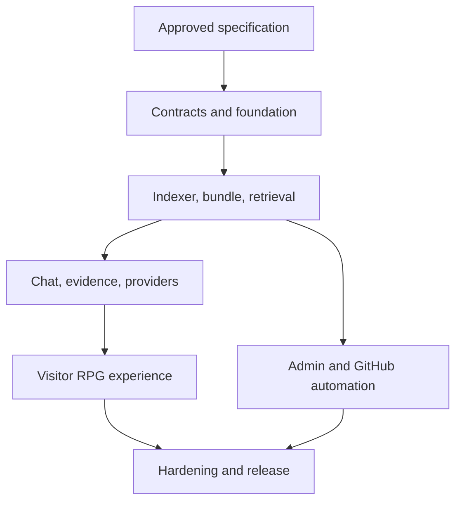

# RepoNPC v1 Complete Implementation Plan

| Field | Value |
| --- | --- |
| Plan status | Approved through Technical Specification 0.1.9 |
| Product scope | Complete v1; milestones do not reduce scope |
| Implementation status | Delivery Phases 1 through 4 and the 0.1.6/0.1.7 milestones have substantial local automated evidence; the 10.4 no-dead-end correction and Phase 5 release hardening remain in progress |
| Expected duration | Approximately 8–12 weeks for one developer |

The owner-approved 2026-08-11 Phase 2 closure amendment is recorded in ADR-015 and Technical Specification 0.1.1. Its local adapter remains an isolated build/benchmark fixture; the 0.1.9 plan no longer treats it as a production default or runtime requirement.

The owner-approved 2026-08-14 first-owner amendment is recorded in ADR-016 and Technical Specification 0.1.2. It replaces product default/pre-required credentials with a host-issued one-time setup code while retaining explicit environment pre-provisioning compatibility and separating authentication from optional GitHub operations.

The owner-approved 2026-08-14 personal-deployment convenience amendment is recorded in ADR-017 and Technical Specification 0.1.3. It retains four-character passwords only for explicit loopback evaluation and moves the Windows one-click launcher's default local port to 8090 while preserving explicit overrides and the production port contract. Production/non-loopback policy is now ADR-024.

The local launcher implementation must reconcile stale launcher-owned processes on startup. Its process-tree stop may use a direct stop fallback only after the state-file PID and configured Python executable have been verified; unknown processes on the requested port remain fail-closed.

The owner-approved 2026-08-15 vLLM amendment is recorded in ADR-019 and Technical Specification 0.1.5. It adds a named server-side preset over the existing OpenAI-compatible transport, private-origin policy, selected-model preflight, and provider documentation without adding another wire protocol, bundle schema, browser secret flow, or fallback.

The owner-approved 2026-08-16 GitHub identity amendment is recorded in ADR-020 and Technical Specification 0.1.6. Milestones A–C amend contracts, add OAuth identity/encrypted public-read credential foundations, and implement the dual-authentication UI. Milestones D–F in `GITHUB_LOGIN_AND_BATCH_ANALYSIS_PLAN.md` remain independent later work and are not implied by this delivery.

The owner-approved 2026-08-30 OAuth setup-guidance amendment is recorded in ADR-022 and Technical Specification 0.1.8. It updates AC-043 so unconfigured GitHub entry points open a safe host-side guide instead of being disabled, adds the non-sensitive setup-guide API, and requires a shared icon button plus dialog accessibility coverage. OAuth token expiry/refresh/rotation remains explicitly deferred until a separate approved lifecycle change.

The owner-approved 2026-08-30 engineering decisions are recorded in ADR-023 through ADR-026 and Technical Specification 0.1.9. They require an external embedding profile with CRUD/one-active/probe/reindex lifecycle, a provider-aware Ollama model center without arbitrary downloads, a deployment-aware password/private-admin topology, local-password-first setup with optional GitHub binding and host recovery, and a bounded Web Admin plus operations CLI split.

## 1. How an implementation Agent should use this plan

This document provides work order and integration gates. It does not replace the normative behavior in `TECHNICAL_SPEC.md` or the proof required by `ACCEPTANCE_CRITERIA.md`.

Required reading before implementation:

1. `PROJECT_CONTEXT.md`
2. `OWNER_REVIEW.md`
3. `TECHNICAL_SPEC.md`
4. `ACCEPTANCE_CRITERIA.md`
5. `DECISIONS.md`
6. `SECURITY.md`
7. this plan
8. `DELIVERY_PHASES.md` for the approved MVP-first sequencing
9. `SUBAGENT_EXECUTION_PLAYBOOK.md` before any delegated implementation campaign
10. `OPERATIONS.md` and `SPRITE_FORMAT.md` for their relevant workstreams
11. root `AGENTS.md`, `reponpc.example.yml`, and `.env.example`

Do not begin milestone 1 until the owner explicitly approves Technical Specification 0.1.0. If implementation exposes a contract ambiguity, follow `AGENTS.md`: decide only internal reversible details and escalate anything that changes scope, externally visible behavior, data/API compatibility, security, privacy, or cost.

## 2. Product objective and complete v1 scope

RepoNPC is an open-source, self-hosted, interactive developer portfolio. It has two linked surfaces:

1. a static-safe animated NPC card embedded in a GitHub Profile README;
2. a separately hosted RPG-style site where visitors ask about the developer's selected projects and receive evidence-backed answers.

The visual character creates recognition; the core product value is trustworthy project discovery. RepoNPC must let a recruiter or technical visitor quickly understand what exists, what the owner says they contributed, how the repositories work, and where the supporting source can be verified.

The complete v1 includes the visitor site, admin site, bilingual behavior, character builder/custom sheet, SVG/GIF/PNG card, curated repository ingestion, Tree-sitter chunking, hybrid retrieval, model adapters, validated citations, GitHub writeback, Actions bundles, self-host deployment, security/cost controls, evaluation, and operations documentation. These are all release requirements.

## 3. Architecture and dependency flow

RepoNPC uses a modular monolith shipped as one production application image. Indexing remains a CLI from the same Python package in GitHub Actions for the current publication contract, preventing schema/chunking drift. The builder receives a frozen external embedding-profile snapshot and must produce the same bundle identity; this amendment does not silently add a deployment-side indexer or provider fallback. The local-publication topology remains the separately tracked UXD-003 decision.

The dependency order is deliberate:

- configuration/evidence schemas precede indexing and UI;
- index/bundle compatibility precedes chat and deployment update logic;
- retrieval and citation validation precede public answer rendering;
- the canonical character sheet precedes both visitor animation and card generation;
- admin writeback consumes the same validation used by the indexer;
- release hardening measures the integrated system rather than isolated mocks alone.

## 4. Work standards across all milestones

Every milestone must:

- reference FR/NFR and acceptance IDs in tasks/changes;
- include typed public module boundaries and locked dependencies;
- add normal, edge, failure, and trust-boundary tests proportional to the change;
- keep public, secret, immutable, and mutable data in their specified locations;
- keep `zh-TW` and `en` behavior in sync;
- update examples and documentation in the same change as a contract;
- preserve a runnable/testable integration point rather than landing disconnected placeholders;
- record exact checks run and any criterion not yet applicable.

Any delegated implementation work must also follow `SUBAGENT_EXECUTION_PLAYBOOK.md`. That document routes work and evidence but does not replace this plan, the Technical Specification, or the Acceptance Criteria.

## 5. Milestone 0 — Owner review and specification approval

**Objective:** remove product-level ambiguity before code exists.

### Tasks

- Review all proposed ADRs and the owner decisions listed in Technical Specification sections 4, 5, 8, 11, 12, and 14.
- Confirm the custom sprite grid, external embedding-profile contract, buffered validation/streaming policy, admin authentication/writeback scope, and GitHub Release publication design.
- Record requested changes in the specification/examples/acceptance criteria.
- Explicitly approve Technical Specification 0.1.0; change its status to `Approved` and proposed ADRs to `Accepted`.

### Exit gate

- No unresolved decision changes public behavior, security, data compatibility, operational dependencies, or v1 scope.
- The specification and ADR status changes are committed before application code.

## 6. Milestone 1 — Foundation and contracts

**Primary requirements:** FR-001, FR-008, FR-012, FR-017, FR-022; NFR-001, NFR-002, NFR-010–NFR-014  
**Acceptance focus:** AC-001, AC-002, AC-010, AC-015, AC-024, AC-036

### Deliverables

- Create the normative repository structure, Python/TypeScript workspaces, lockfiles, formatting/lint/type/test configuration, and CI.
- Implement strict Pydantic/domain schemas for YAML, public profile, evidence, citations, manifests, provider capabilities, errors, and API messages.
- Implement environment/secret-file loading with collision checks and redacted diagnostics.
- Establish FastAPI application lifecycle, versioned internal boundaries, request IDs, common errors, safe logging, security headers, health/setup state, and built React serving.
- Establish runtime SQLite migrations for sessions, rate/budget data, bundle state, and safe audit entries.
- Add Compose development/production scaffolding with non-root runtime, read-only application filesystem where feasible, health checks, and persistent data volume.
- Create bilingual message catalog and missing-key parity test.
- Create provider and GitHub mock servers used by later integration tests.

### Exit gate

- Valid/invalid example configuration contract tests pass.
- Both workspaces pass formatting, lint, type checking, unit tests, and production build.
- A source-free skeleton container reaches `healthz` and the documented setup-required state without leaking configuration.
- No endpoint accepts model or GitHub secrets from a browser request.

## 7. Milestone 2 — Repository indexing, search, and immutable bundles

**Primary requirements:** FR-002–FR-007, FR-020, FR-021; NFR-001, NFR-003, NFR-004, NFR-006, NFR-008, NFR-011  
**Acceptance focus:** AC-003–AC-009, AC-029–AC-032

### Deliverables

- Implement GitHub repository/ref resolution with host/repository validation, timeouts, limits, and immutable commit recording.
- Implement mandatory/global/configured exclusions, MIME/encoding checks, secret scanning, and safe skipped-file reports.
- Add Tree-sitter adapters for Python, JavaScript, TypeScript/TSX, Go, and Rust plus Markdown/text fallback.
- Generate stable sources/evidence IDs, owner-assertion source ranges, metadata, and deterministic chunks.
- Build schema-v1 `index.sqlite`, dual FTS5 indexes, normalized embedding blobs, and NumPy vector matrix loading.
- Integrate the external embedding-profile snapshot into real index builds and the formal benchmark. Keep `local_sentence_transformers` only as an isolated reproducibility fixture; production builds must use Ollama, vLLM, or generic OpenAI-compatible embeddings and record the probed identity.
- Implement the installed `reponpc` dispatch so no arguments/`serve` start the application and `config validate`, `index build`, `index publish`, and `index publish-manifest` execute the workflow without entering server startup.
- Produce line-addressable root manifest evidence as `repository_metadata` `REPOSITORY_FACT` records while preserving owner role/summary/claims as `OWNER_ASSERTION`.
- Implement lexical query safety, semantic lookup, metadata policy, overlap deduplication, RRF, context packing, and retrieval diagnostics.
- Build the evaluation fixture repositories/questions and benchmark command early enough to tune with evidence.
- Implement canonical bundle/card asset layout, canonical JSON manifests, checksums, safe `tar.zst` creation/extraction, database integrity checks, and smoke query.
- Generate one complete bilingual `public/profile.json`, validate both locales before activation, and make the existing public route select the requested locale without fallback.
- Implement stable-manifest polling, ETag behavior, staging, validation, atomic activation, concurrent request handles, retention, pinning, and rollback.
- Implement `build-index.yml`: validate, index, test, upload immutable GitHub Release asset, verify it, and update stable manifest last.
- Run formal retrieval acceptance with a Docker candidate limited to four CPUs/8 GiB and no oracle access; score with a host-only controller and derive all formal booleans from inspection, provider identity, repeatability, measurements, and thresholds.

### Exit gate

- AC-003 through AC-009 and bundle negative cases pass on fixtures.
- Recall@8 and language parity targets pass or the owner reviews a documented blocker before dependent answer work continues.
- Corrupt/incompatible/malicious candidates never replace the last known-good bundle.
- Identical inputs produce stable evidence IDs and declared-equivalent bundle contents.

## 8. Milestone 3 — Chat, providers, citations, and public limits

**Primary requirements:** FR-008–FR-013, FR-023; NFR-001, NFR-002, NFR-005, NFR-007, NFR-012, NFR-014  
**Acceptance focus:** AC-010–AC-018, AC-032, AC-033, AC-035

### Deliverables

- Implement generic OpenAI-compatible, vLLM-preset, and Ollama chat/embedding support with external profile probe/readiness, bounded retries, and normalized failures. Do not integrate the local sentence-transformers adapter into the production runtime.
- Implement question/history validation, language handling, hybrid retrieval orchestration, context/token budgeting, and untrusted-evidence delimiters.
- Define provider prompts/output envelope and one bounded repair path.
- Implement complete-output buffering, evidence-ID validation, material-claim/citation checks, owner-assertion policy, inference dependencies, sanitization, and safe abstention.
- Construct immutable permalinks only from index metadata and percent-encode paths safely.
- Implement the exact SSE sequence, heartbeat, disconnect/timeout behavior, terminal errors, and safe usage reporting.
- Implement HMAC-pseudonymous IP buckets, global concurrency, UTC daily budget, input/output limits, and pre-provider rejection.
- Extend public status/readiness for independent index, embedding, and chat states.

### Exit gate

- Both model families pass the same contract suite through mocks; a small documented live compatibility matrix is complete before release.
- Citation resolution >=95%, entailment >=90%, unsupported abstention >=90%, and no unasserted person claim pass the committed evaluation.
- Prompt injection, forged source ID, unsafe Markdown/URL, provider failure, limit, and no-fallback tests pass.
- Public streams never expose unvalidated partial content.

## 9. Milestone 4 — Visitor and RPG experience

**Primary requirements:** FR-014–FR-016, FR-022–FR-024; NFR-005, NFR-008, NFR-009  
**Acceptance focus:** AC-019–AC-023, AC-028, AC-034

### Deliverables

- Implement responsive visitor layout, profile/projects, suggested quests, chat input/history, availability/setup states, and citation panel.
- Connect lifecycle to idle/listen/think/talk/success/offline character states without putting semantic content only in animation/canvas.
- Build the character composer with stable asset IDs and canonical `128x224` output.
- Implement custom sheet decode/re-encode/validation and preview.
- Implement keyboard/focus/screen-reader behavior, visible status announcements, contrast, touch targets, reduced motion, and error recovery.
- Implement `zh-TW`/`en` UI/profile/chat switching without erasing conversation.
- Generate sanitized self-contained SVG plus GIF/PNG variants and cache validators from canonical card/character data.
- Implement copy-ready README snippets and target-link preview.
- Write `docs/SPRITE_FORMAT.md` with diagram, template, timing, validation, and licensing information.

### Exit gate

- Visitor Playwright flows pass for desktop/mobile, both locales, keyboard, reduced motion, errors, citations, and offline/setup states.
- Automated accessibility checks pass and manual keyboard/screen-reader review has no release-blocking issue.
- Card injection tests pass; real GitHub Profile checks confirm static first-frame and fallback behavior in named browsers.

## 10. Milestone 5 — Administration and GitHub automation

**Primary requirements:** FR-017–FR-021, FR-024; NFR-001–NFR-003, NFR-012  
**Acceptance focus:** AC-024–AC-032, AC-034, AC-035

### Deliverables

- Implement first-owner onboarding with no default credential: host-issued 15-minute one-time setup code, durable Argon2id owner, atomic initial session, permanent setup closure, and optional legacy environment pre-provisioning. The first owner always creates local username/password before any optional GitHub link.
- Implement deployment-local external embedding profiles: CRUD, provider/model probe, one active profile, Ollama model-center pull/delete allowlist, vLLM/OpenAI-compatible connect-only behavior, reindex-required state, and atomic last-known-good activation.
- Implement explicit `loopback_evaluation` versus `production` password policy, common-password blocking, private admin route ACLs, SSH/VPN guidance, and tests proving an unusual port is not an access control.
- Keep admin authentication usable without a GitHub token; gate only GitHub-backed operations when the token is absent.
- Implement Argon2id credential verification, login backoff, server-side session/CSRF lifecycle, cookie/origin policy, logout, and logout-all.
- Implement configuration fetch/editor, raw YAML mode, field validation, bilingual completeness, warnings, and side-effect-free profile/card/character previews.
- Implement validated custom asset preview/upload.
- Implement least-privilege GitHub contents writes for the exact allowlist, expected blob-SHA conflicts, safe commit messages, and audit entries.
- Implement Actions workflow dispatch and safe publication/activation status for the owner.
- Integrate README snippet generator with final public URLs/revisions.
- Implement the bounded host operations CLI: `admin set-password`, `runtime check/backup`, and `bundle status/verify/pin/unpin`; Web Admin remains the daily configuration surface.
- Add admin browser tests for validation, save, conflicts, assets, dispatch, expiry, revocation, CSRF, locale, and mobile layout.

### Exit gate

- First-owner expiry/reissue/concurrency/durability plus session/CSRF/backoff/revocation and all writeback allowlist/conflict security tests pass.
- Admin preview causes no external mutation; save creates only the expected Git commit.
- Secrets/private provider data never enter UI responses, Git history, bundle, logs, snapshots, or fixtures.
- The complete owner update journey triggers a new bundle and runtime activation while preserving rollback.

### 10.1 Guided owner-onboarding extension (0.1.4, approved)

OR-010 and Technical Specification 0.1.4 were owner-approved on 2026-08-14. Use a fresh full-profile Agent Foreman campaign with Main retaining all public/network/provider/evidence/lifecycle seams.

Implementation dependency order:

1. Main freezes the authenticated onboarding endpoints, stable errors, 50-by-5 discovery pagination, selected-set confirmation, optional-analysis/manual-continuation boundary, cleanup/cancellation, provider admission, evidence/confirmation conversion, reversible navigation with selective invalidation, session-only resume, and YAML draft/export contracts. The 0.1.7 durable batch lifecycle supersedes the original synchronous execution design but not these UX/trust boundaries.
2. Main implements public metadata discovery/manual resolution with GitHub host/redirect/rate-limit tests and proves that listing makes no source/model/token call.
3. Main implements selected-only analysis by reusing production source resolution, exclusions, parsing, evidence, retrieval, provider, and output validation. The legacy one-item route delegates to the durable batch engine rather than maintaining a second lifecycle. Integration gates cover exact commit resolution, prompt injection, no fallback, one active owner batch, compatibility-route delegation, 120/45-second deadlines, restart/cancellation behavior, safe durable metadata, and staging cleanup.
4. Main implements contribution suggestions, explicit owner accept/edit/reject state, schema-v1 YAML generation, existing validation/preview integration, no-token copy/download, GitHub save, and publication separation.
5. After Main freezes the typed view model, a qualified Luna worker may own at most one new presentational component and one focused test file. A separate pure reducer/test leaf is eligible only if exact paths and transitions are disjoint. Workers do not own fetch, endpoints, persistence, evidence conversion, localization contracts, or shared CSS/router changes.
6. Main integrates desktop/mobile bilingual accessibility, browser session resume/clear behavior, advanced raw YAML, safe errors and disabled reasons. Tests prove that provider/GitHub blockers before batch creation still expose one-action manual continuation, Back/Edit preserves unaffected data, and unavailable optional capabilities do not disable unrelated local work. A fresh read-only evaluator then falsifies AC-038 through AC-040.

Exit gate: discovery/analysis/confirmation contract and security suites pass; ordinary preview remains model-free; unconfirmed claims never enter YAML; manual continuation works before preflight and after every blocker/failure; Back/Edit requires no full reset and preserves unaffected input; copy/download works without GitHub; every blocked primary action exposes a reason, recovery, and safe alternative; selected-only and cleanup probes pass; Prettier, ESLint, TypeScript, frontend tests/build, Python format/lint/type/tests, API/schema/security tests, Playwright/accessibility, and `git diff --check` pass.

### 10.2 GitHub identity and connection extension (0.1.6, approved)

**Progress status (2026-08-16): Complete for Milestones A–C; D–E locally automated verification complete; F remains in progress.** The normative amendment, runtime migration, OAuth Web Flow + PKCE transactions, host-proof/recovery enforcement, password compatibility, encrypted OAuth/PAT connection records, dual-authentication UI, bilingual copy, accessibility semantics, and security/migration regression tests are implemented and locally verified. The 0.1.7 GraphQL/exact-SHA resolver, safe archive handling, rate persistence, durable batch engine, SSE recovery, cache separation, and fair provider permits are also implemented. The final non-Docker Python suite passed `599 passed, 2 skipped, 1 deselected`; frontend format/type/test/build passed with 53 tests. Docker/Compose, real GitHub/OAuth, live-provider, clean-host, and full browser/accessibility evidence remains outstanding, so Milestone F and v1 are not complete.

**D-E repair verification addendum (2026-08-16):** Non-Docker Python `606 passed, 2 skipped`; focused D-E `41 passed`; release audit `12 passed`; launcher contract `5 passed`; frontend Vitest `53 passed` with Prettier/typecheck/build and ESLint zero errors (8 existing warnings). The launcher lock was cleared and frozen `uv sync` completed, but host-denied Hugging Face network access blocked embedding startup health. AC-036 clean x86_64 Linux is explicitly deferred/not-run and Milestone F remains in progress.

Latest rerun correction: non-Docker Python `607 passed, 2 skipped`; release audit `13 passed`. The release gate status is unchanged.

1. Update the normative docs, acceptance criteria, ADR, security/operations guidance, and configuration examples together before application changes.
2. Add a transactional runtime migration for OAuth transactions, credential purposes/encryption, GitHub numeric identities, and recent authentication without breaking password or pre-provisioned deployments.
3. Implement real GitHub Authorization Code Web Flow plus PKCE for authenticated login/link contexts; require host proof followed by local password creation for first-owner setup. GitHub is optional and never replaces local recovery.
4. Implement the same-origin dual-login, linking, connection/PAT UI with independent pending state, `zh-TW`/`en` parity, focus/error handling, and secret-canary tests.

Exit gate: AC-041 through AC-043 pass with mocked authorization/token/user endpoints; migration/password regression, transaction replay/cross-intent, encryption/no-plaintext, no-writeback-fallback, keyboard/accessible UI, type/lint/build, and focused browser tests pass. **This exit gate is complete for Milestones A–C as of 2026-08-16.** The 0.1.7 GraphQL resolver, preflight, batch jobs, caching, queue fairness, and provider concurrency implementation has passed the local automated suite; its external and release-host verification remains in the release-hardening gate.

### 10.3 OAuth setup-guidance UX amendment (0.1.8, approved)

**Progress status (2026-08-30):** The API, shared button/dialog, launcher mappings, documentation, and local regression coverage are implemented. Frontend and non-Docker Python checks pass; real-browser/accessibility, Docker/Compose, and clean-host evidence remain part of Phase 5 release hardening.

1. Expose the non-sensitive setup-guide contract with the canonical callback URL and fixed GitHub documentation link.
2. Replace disabled unconfigured OAuth controls with one shared GitHub mark button that opens the host-side guide; preserve top-level redirects only for configured OAuth.
3. Implement focus trap, Escape close, focus return, bilingual status/error announcements, responsive layout, and no-secret browser tests.
4. Add Windows launcher mappings for both OAuth client-secret and credential-encryption-key file forms, including collision/missing-file coverage.

Exit gate: the updated AC-043 UI/API/security/launcher tests pass; no secret, token, owner identity, or secret-file path appears in the guide response, DOM, logs, fixtures, or snapshots.

### 10.4 Recoverable-capability UX correction

This correction implements existing FR-025/FR-027/FR-028/NFR-003 intent and the strengthened AC-019/AC-025/AC-032/AC-040 wording. It does not change credential purpose, API authorization, schema, or fallback policy.

The wider P0/P1/P2 sequence, deployment/security gates, and owner-decision boundaries are defined in `docs/SPEC_AND_ENGINEERING_REMEDIATION_PLAN.md`. That review plan cannot approve an ENGD/UXD contract change; it blocks affected implementation until the matching owner decision is recorded.

1. Add an explicit skip/manual transition that works while analysis is idle and when provider readiness, GitHub connection, or batch preflight blocks job creation.
2. Add Back/Edit-selection transitions and selection-identity-based invalidation. Preserve profile data and repository contributions/results whose slug/ref/include/exclude identity did not change; confirm destructive Start over.
3. Replace page-wide readiness gating with capability-specific view state for sign-in, public read, analysis, writeback, and publication. Every unavailable primary action gets a visible/programmatic reason, recovery/recheck, and unaffected local alternative.
4. Move rate budget, cache prediction, semaphore/concurrency, and scheduler detail behind Advanced diagnostics. Keep the primary guided flow centered on choose, describe/confirm, and preview/export.
5. Stream already-validated SSE chunks into the visitor transcript as they arrive; add profile/chat retry/recheck, focus behavior, and safe evidence class/location rendering.
6. Add reducer, component, integration, and browser regressions for all no-dead-end and preservation cases before adding another integration or batch-control feature.

Exit gate: the P0/P1 verified findings in `docs/UX_SPEC_REVIEW.md` have a passing regression or an explicit owner-approved deferral, and all previously approved security/provider/evidence boundaries remain unchanged.

### 10.5 Engineering decisions 0.1.9 (approved)

The following work is authorized by ENGD-001, ENGD-002, ENGD-003, and ENGD-006. It is a release-blocking implementation package, not a new product expansion.

1. **Embedding profile registry:** add the runtime schema/API/UI for profile CRUD, safe probe, one active profile, observed identity, reindex state, and atomic last-known-good switching. Keep chat and embedding settings separate.
2. **Provider-aware model center:** implement only curated Ollama catalog/list/pull/delete operations; vLLM and generic OpenAI-compatible paths list/probe/select. Reject arbitrary URLs, local paths, shell commands, and unverified archives.
3. **Index integration:** pass a frozen external profile snapshot to the index builder, record the same identity in the bundle, and verify that a profile change cannot activate until reindex/smoke checks pass. Preserve isolated local-adapter benchmark fixtures without shipping them as runtime defaults.
4. **Admin security:** enforce deployment-aware password boundaries (4–128 loopback evaluation; 15–128 production/non-loopback), block common passwords, and test loopback/SSH/VPN/reverse-proxy route policy.
5. **Local-first recovery:** create local credentials first, link GitHub only after authentication, retain local break-glass recovery, remove the recovery-command readiness switch, and test backup/restore plus `admin set-password`.
6. **Operations surface:** implement and test `runtime` and `bundle` CLI groups with explicit paths/IDs and stable errors. Do not duplicate daily Web Admin workflows or add a public management protocol.

**Exit gate:** AC-047 through AC-050, updated AC-008/AC-024/AC-032/AC-036/AC-041/AC-042/AC-043, security regression tests, clean-host provider probe, SSH/proxy route checks, and backup/pin/rollback evidence pass. Until then, the documents may describe the approved contract but must label unimplemented commands/features as release-blocking work.

## 11. Milestone 6 — Hardening, documentation, and v1 release

**Primary requirements:** all FR/NFR  
**Acceptance focus:** AC-001–AC-050

### Deliverables

- Run full unit, contract, integration, security, evaluation, browser, accessibility, image, bundle, Compose, upgrade, and rollback suites.
- Exercise the Windows local launcher across a clean start, a stale launcher-owned process, and an unknown process occupying the port; verify that only the owned stale process is stopped and that the direct-stop fallback remains PID-bounded.
- Test at least one representative generic OpenAI-compatible service, one vLLM deployment, and one Ollama model live without committing credentials/output bodies.
- Profile reference-corpus retrieval memory/latency and application concurrency; correct measured bottlenecks without weakening controls.
- Complete `docs/SECURITY.md`, `docs/OPERATIONS.md`, `docs/SPRITE_FORMAT.md`, threat model, operator checklist, provider compatibility, backup/restore, upgrade, and rollback guidance.
- Add MIT `LICENSE`, third-party notices/asset provenance, contribution/release guidance, version policy, and security reporting route.
- Build the production image from locked dependencies, scan dependencies/image/secrets, and run a clean-host Compose install.
- Execute the acceptance report format with evidence for every AC.

### Exit gate

- All 50 acceptance criteria pass or the owner explicitly changes the governing requirement before release.
- CI, benchmark thresholds, security gates, clean install, and real GitHub/browser checks pass.
- A tagged MIT-licensed v1 release, application image, immutable sample bundle, and complete operator documents are available.

## 12. Test and evaluation strategy

### Unit and contract

Schemas, path normalization, exclusions, parsers, chunking/IDs, FTS query generation, vector validation, RRF, context packing, provider capabilities, answer parsing, citations, XML/Markdown escaping, manifests/checksums, sessions/CSRF, rate limits, budget, and errors.

### Integration

Fixture GitHub repositories plus mocked GitHub contents/actions/releases, OpenAI-compatible APIs, Ollama, embedding service, manifest server, reverse proxy behavior, runtime SQLite, and concurrent bundle readers.

### Evaluation

Questions cover project overview, exact filenames/symbols, architecture, dependencies, semantic paraphrases, cross-language questions, owner responsibilities, owner achievements, repository-only facts, inference labeling, unsupported/private experience, and prompt injection. Expected evidence and claim labels are reviewed rather than generated by the model under test.

### Browser and visual

Visitor/admin happy and failure flows, locale switch, streaming/citations, mobile, keyboard, focus, screen reader announcements, reduced motion, character states, injection, and README snippet. Card rendering uses deterministic image comparisons with a small tolerance plus real-GitHub manual evidence.

### Operations/security

Clean Compose start/restart, first setup, model outage, budget exhaustion, bundle corruption, upgrade/pin/rollback, secret and dependency scans, container privilege/filesystem review, safe logging canaries, SSRF/redirect attempts, and GitHub permission/allowlist verification.

## 13. Risks and mitigation order

| Risk | Mitigation built into plan |
| --- | --- |
| Retrieval quality for Chinese/code varies by model/tokenizer | Build evaluation in milestone 2; keep embeddings configurable and hybrid with exact lexical search. |
| Model speaks beyond evidence | Buffer output, validate IDs/claim policy, evaluate entailment/abstention, and prefer safe refusal. |
| Repository prompt injection | Treat all content as delimited data; no model tools/network; adversarial fixtures and security tests. |
| README SVG animation differs through GitHub proxy | Static-complete first frame, GIF/PNG fallbacks, revisioned URLs, real-profile tests. |
| GitHub update partially publishes | Immutable release first, stable manifest last, checksums, atomic runtime activation, rollback. |
| Admin becomes a write/security boundary | Single admin, secure sessions/CSRF, least-privilege token, exact file allowlist, blob-SHA conflicts, private route ACLs, and SSH/VPN access. |
| Local hardware cannot run chosen models | External provider profile probe, curated model catalog/resource notes, explicit reindex state, and measured requirements; no implicit local runtime/download. |
| Embedding profile and bundle drift | Store one observed identity, freeze it into the build, require probe/reindex/smoke before atomic activation, and retain last-known-good. |
| Provider model installation becomes an SSRF/supply-chain vector | Keep downloads provider-native; allow only curated Ollama IDs; vLLM/API are connect/probe-only; reject arbitrary URLs, paths, and commands. |
| Recovery path is advertised but unusable | Make local password mandatory, test host-only `set-password` against backup/restore, and remove free-form recovery readiness. |
| Operations contract diverges from CLI | Add help/negative/clean-host tests for every normative command; label unimplemented commands as release blockers. |
| Full v1 scope overruns schedule | Keep all scope but integrate in dependency order with hard exit gates and visible acceptance evidence. |

## 14. Planning assumptions

- One developer or implementation Agent stream works primarily in dependency order; independent UI asset/test preparation may run in parallel only after contracts are approved.
- The owner supplies public HTTPS/domain, GitHub repository/action permissions, model service and credentials, and provider costs/hardware.
- The owner chooses one external embedding interface and accepts its provider-host model lifecycle; the initial recommendation is Ollama `qwen3-embedding:0.6b`.
- Production administration is loopback/SSH/private-LAN/VPN or reverse-proxy allowlisted; a non-standard port is not treated as protection.
- Selected repositories and configuration repository are public in v1.
- Reference deployment has at least 4 CPU cores and 8 GB RAM; a local chat model may require additional resources documented by its operator.
- GitHub.com is the initial immutable citation host; GitHub Enterprise requires a future explicit host/configuration extension.
- Full v1 remains estimated at 8–12 weeks; custom art production and live-provider/browser compatibility are the largest schedule variables.

## 15. Completion reporting

At each milestone, the implementation Agent reports:

- delivered behavior and files/modules changed;
- FR/NFR and AC IDs addressed;
- commands/checks run and exact pass/fail/not-run result;
- measured benchmark/security/browser evidence where applicable;
- remaining dependencies and risks;
- any decision requiring owner confirmation.

The Agent must not call v1 complete because all milestones contain code. Completion means the integrated release satisfies the acceptance evidence in `ACCEPTANCE_CRITERIA.md`.
