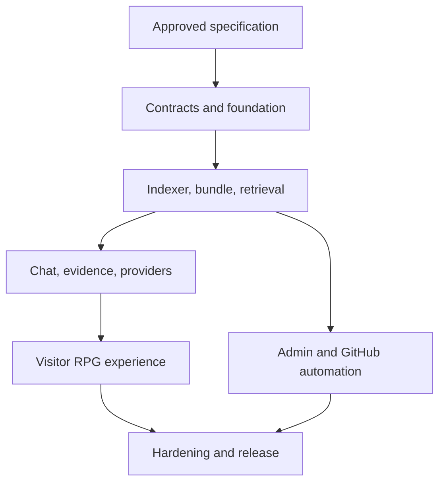

# RepoNPC v1 Complete Implementation Plan

| Field | Value |
| --- | --- |
| Plan status | Approved, aligned to Technical Specification 0.1.0 |
| Product scope | Complete v1; milestones do not reduce scope |
| Implementation status | Authorized on 2026-08-10; MVP delivery phase in progress |
| Expected duration | Approximately 8–12 weeks for one developer |

## 1. How an implementation Agent should use this plan

This document provides work order and integration gates. It does not replace the normative behavior in `TECHNICAL_SPEC.md` or the proof required by `ACCEPTANCE_CRITERIA.md`.

Required reading before implementation:

1. `PROJECT_CONTEXT.md`
2. `OWNER_REVIEW.md`
3. `TECHNICAL_SPEC.md`
4. `ACCEPTANCE_CRITERIA.md`
5. `DECISIONS.md`
6. `SECURITY.md`
7. this plan
8. `DELIVERY_PHASES.md` for the approved MVP-first sequencing
9. `SUBAGENT_EXECUTION_PLAYBOOK.md` before any delegated implementation campaign
10. `OPERATIONS.md` and `SPRITE_FORMAT.md` for their relevant workstreams
11. root `AGENTS.md`, `reponpc.example.yml`, and `.env.example`

Do not begin milestone 1 until the owner explicitly approves Technical Specification 0.1.0. If implementation exposes a contract ambiguity, follow `AGENTS.md`: decide only internal reversible details and escalate anything that changes scope, externally visible behavior, data/API compatibility, security, privacy, or cost.

## 2. Product objective and complete v1 scope

RepoNPC is an open-source, self-hosted, interactive developer portfolio. It has two linked surfaces:

1. a static-safe animated NPC card embedded in a GitHub Profile README;
2. a separately hosted RPG-style site where visitors ask about the developer's selected projects and receive evidence-backed answers.

The visual character creates recognition; the core product value is trustworthy project discovery. RepoNPC must let a recruiter or technical visitor quickly understand what exists, what the owner says they contributed, how the repositories work, and where the supporting source can be verified.

The complete v1 includes the visitor site, admin site, bilingual behavior, character builder/custom sheet, SVG/GIF/PNG card, curated repository ingestion, Tree-sitter chunking, hybrid retrieval, model adapters, validated citations, GitHub writeback, Actions bundles, self-host deployment, security/cost controls, evaluation, and operations documentation. These are all release requirements.

## 3. Architecture and dependency flow

RepoNPC uses a modular monolith shipped as one production application image. Indexing runs as a CLI from the same Python package in GitHub Actions, preventing schema/chunking drift.

The dependency order is deliberate:

- configuration/evidence schemas precede indexing and UI;
- index/bundle compatibility precedes chat and deployment update logic;
- retrieval and citation validation precede public answer rendering;
- the canonical character sheet precedes both visitor animation and card generation;
- admin writeback consumes the same validation used by the indexer;
- release hardening measures the integrated system rather than isolated mocks alone.

## 4. Work standards across all milestones

Every milestone must:

- reference FR/NFR and acceptance IDs in tasks/changes;
- include typed public module boundaries and locked dependencies;
- add normal, edge, failure, and trust-boundary tests proportional to the change;
- keep public, secret, immutable, and mutable data in their specified locations;
- keep `zh-TW` and `en` behavior in sync;
- update examples and documentation in the same change as a contract;
- preserve a runnable/testable integration point rather than landing disconnected placeholders;
- record exact checks run and any criterion not yet applicable.

Any delegated implementation work must also follow `SUBAGENT_EXECUTION_PLAYBOOK.md`. That document routes work and evidence but does not replace this plan, the Technical Specification, or the Acceptance Criteria.

## 5. Milestone 0 — Owner review and specification approval

**Objective:** remove product-level ambiguity before code exists.

### Tasks

- Review all proposed ADRs and the owner decisions listed in Technical Specification sections 4, 5, 8, 11, 12, and 14.
- Confirm the custom sprite grid, default embedding contract, buffered validation/streaming policy, admin authentication/writeback scope, and GitHub Release publication design.
- Record requested changes in the specification/examples/acceptance criteria.
- Explicitly approve Technical Specification 0.1.0; change its status to `Approved` and proposed ADRs to `Accepted`.

### Exit gate

- No unresolved decision changes public behavior, security, data compatibility, operational dependencies, or v1 scope.
- The specification and ADR status changes are committed before application code.

## 6. Milestone 1 — Foundation and contracts

**Primary requirements:** FR-001, FR-008, FR-012, FR-017, FR-022; NFR-001, NFR-002, NFR-010–NFR-014  
**Acceptance focus:** AC-001, AC-002, AC-010, AC-015, AC-024, AC-036

### Deliverables

- Create the normative repository structure, Python/TypeScript workspaces, lockfiles, formatting/lint/type/test configuration, and CI.
- Implement strict Pydantic/domain schemas for YAML, public profile, evidence, citations, manifests, provider capabilities, errors, and API messages.
- Implement environment/secret-file loading with collision checks and redacted diagnostics.
- Establish FastAPI application lifecycle, versioned internal boundaries, request IDs, common errors, safe logging, security headers, health/setup state, and built React serving.
- Establish runtime SQLite migrations for sessions, rate/budget data, bundle state, and safe audit entries.
- Add Compose development/production scaffolding with non-root runtime, read-only application filesystem where feasible, health checks, and persistent data volume.
- Create bilingual message catalog and missing-key parity test.
- Create provider and GitHub mock servers used by later integration tests.

### Exit gate

- Valid/invalid example configuration contract tests pass.
- Both workspaces pass formatting, lint, type checking, unit tests, and production build.
- A source-free skeleton container reaches `healthz` and the documented setup-required state without leaking configuration.
- No endpoint accepts model or GitHub secrets from a browser request.

## 7. Milestone 2 — Repository indexing, search, and immutable bundles

**Primary requirements:** FR-002–FR-007, FR-020, FR-021; NFR-001, NFR-003, NFR-004, NFR-006, NFR-008, NFR-011  
**Acceptance focus:** AC-003–AC-009, AC-029–AC-032

### Deliverables

- Implement GitHub repository/ref resolution with host/repository validation, timeouts, limits, and immutable commit recording.
- Implement mandatory/global/configured exclusions, MIME/encoding checks, secret scanning, and safe skipped-file reports.
- Add Tree-sitter adapters for Python, JavaScript, TypeScript/TSX, Go, and Rust plus Markdown/text fallback.
- Generate stable sources/evidence IDs, owner-assertion source ranges, metadata, and deterministic chunks.
- Build schema-v1 `index.sqlite`, dual FTS5 indexes, normalized embedding blobs, and NumPy vector matrix loading.
- Implement lexical query safety, semantic lookup, metadata policy, overlap deduplication, RRF, context packing, and retrieval diagnostics.
- Build the evaluation fixture repositories/questions and benchmark command early enough to tune with evidence.
- Implement canonical bundle/card asset layout, canonical JSON manifests, checksums, safe `tar.zst` creation/extraction, database integrity checks, and smoke query.
- Implement stable-manifest polling, ETag behavior, staging, validation, atomic activation, concurrent request handles, retention, pinning, and rollback.
- Implement `build-index.yml`: validate, index, test, upload immutable GitHub Release asset, verify it, and update stable manifest last.

### Exit gate

- AC-003 through AC-009 and bundle negative cases pass on fixtures.
- Recall@8 and language parity targets pass or the owner reviews a documented blocker before dependent answer work continues.
- Corrupt/incompatible/malicious candidates never replace the last known-good bundle.
- Identical inputs produce stable evidence IDs and declared-equivalent bundle contents.

## 8. Milestone 3 — Chat, providers, citations, and public limits

**Primary requirements:** FR-008–FR-013, FR-023; NFR-001, NFR-002, NFR-005, NFR-007, NFR-012, NFR-014  
**Acceptance focus:** AC-010–AC-018, AC-032, AC-033, AC-035

### Deliverables

- Implement OpenAI-compatible, Ollama, and local sentence-transformers adapters with capability/identity contracts, health, bounded retries, and normalized failures.
- Implement question/history validation, language handling, hybrid retrieval orchestration, context/token budgeting, and untrusted-evidence delimiters.
- Define provider prompts/output envelope and one bounded repair path.
- Implement complete-output buffering, evidence-ID validation, material-claim/citation checks, owner-assertion policy, inference dependencies, sanitization, and safe abstention.
- Construct immutable permalinks only from index metadata and percent-encode paths safely.
- Implement the exact SSE sequence, heartbeat, disconnect/timeout behavior, terminal errors, and safe usage reporting.
- Implement HMAC-pseudonymous IP buckets, global concurrency, UTC daily budget, input/output limits, and pre-provider rejection.
- Extend public status/readiness for independent index, embedding, and chat states.

### Exit gate

- Both model families pass the same contract suite through mocks; a small documented live compatibility matrix is complete before release.
- Citation resolution >=95%, entailment >=90%, unsupported abstention >=90%, and no unasserted person claim pass the committed evaluation.
- Prompt injection, forged source ID, unsafe Markdown/URL, provider failure, limit, and no-fallback tests pass.
- Public streams never expose unvalidated partial content.

## 9. Milestone 4 — Visitor and RPG experience

**Primary requirements:** FR-014–FR-016, FR-022–FR-024; NFR-005, NFR-008, NFR-009  
**Acceptance focus:** AC-019–AC-023, AC-028, AC-034

### Deliverables

- Implement responsive visitor layout, profile/projects, suggested quests, chat input/history, availability/setup states, and citation panel.
- Connect lifecycle to idle/listen/think/talk/success/offline character states without putting semantic content only in animation/canvas.
- Build the character composer with stable asset IDs and canonical `128x224` output.
- Implement custom sheet decode/re-encode/validation and preview.
- Implement keyboard/focus/screen-reader behavior, visible status announcements, contrast, touch targets, reduced motion, and error recovery.
- Implement `zh-TW`/`en` UI/profile/chat switching without erasing conversation.
- Generate sanitized self-contained SVG plus GIF/PNG variants and cache validators from canonical card/character data.
- Implement copy-ready README snippets and target-link preview.
- Write `docs/SPRITE_FORMAT.md` with diagram, template, timing, validation, and licensing information.

### Exit gate

- Visitor Playwright flows pass for desktop/mobile, both locales, keyboard, reduced motion, errors, citations, and offline/setup states.
- Automated accessibility checks pass and manual keyboard/screen-reader review has no release-blocking issue.
- Card injection tests pass; real GitHub Profile checks confirm static first-frame and fallback behavior in named browsers.

## 10. Milestone 5 — Administration and GitHub automation

**Primary requirements:** FR-017–FR-021, FR-024; NFR-001–NFR-003, NFR-012  
**Acceptance focus:** AC-024–AC-032, AC-034, AC-035

### Deliverables

- Implement Argon2id credential verification, login backoff, server-side session/CSRF lifecycle, cookie/origin policy, logout, and logout-all.
- Implement configuration fetch/editor, raw YAML mode, field validation, bilingual completeness, warnings, and side-effect-free profile/card/character previews.
- Implement validated custom asset preview/upload.
- Implement least-privilege GitHub contents writes for the exact allowlist, expected blob-SHA conflicts, safe commit messages, and audit entries.
- Implement Actions workflow dispatch and safe publication/activation status for the owner.
- Integrate README snippet generator with final public URLs/revisions.
- Add admin browser tests for validation, save, conflicts, assets, dispatch, expiry, revocation, CSRF, locale, and mobile layout.

### Exit gate

- Session/CSRF/backoff/revocation and all writeback allowlist/conflict security tests pass.
- Admin preview causes no external mutation; save creates only the expected Git commit.
- Secrets/private provider data never enter UI responses, Git history, bundle, logs, snapshots, or fixtures.
- The complete owner update journey triggers a new bundle and runtime activation while preserving rollback.

## 11. Milestone 6 — Hardening, documentation, and v1 release

**Primary requirements:** all FR/NFR  
**Acceptance focus:** AC-001–AC-037

### Deliverables

- Run full unit, contract, integration, security, evaluation, browser, accessibility, image, bundle, Compose, upgrade, and rollback suites.
- Test at least one representative OpenAI-compatible service and one Ollama model live without committing credentials/output bodies.
- Profile reference-corpus retrieval memory/latency and application concurrency; correct measured bottlenecks without weakening controls.
- Complete `docs/SECURITY.md`, `docs/OPERATIONS.md`, `docs/SPRITE_FORMAT.md`, threat model, operator checklist, provider compatibility, backup/restore, upgrade, and rollback guidance.
- Add MIT `LICENSE`, third-party notices/asset provenance, contribution/release guidance, version policy, and security reporting route.
- Build the production image from locked dependencies, scan dependencies/image/secrets, and run a clean-host Compose install.
- Execute the acceptance report format with evidence for every AC.

### Exit gate

- All 37 acceptance criteria pass or the owner explicitly changes the governing requirement before release.
- CI, benchmark thresholds, security gates, clean install, and real GitHub/browser checks pass.
- A tagged MIT-licensed v1 release, application image, immutable sample bundle, and complete operator documents are available.

## 12. Test and evaluation strategy

### Unit and contract

Schemas, path normalization, exclusions, parsers, chunking/IDs, FTS query generation, vector validation, RRF, context packing, provider capabilities, answer parsing, citations, XML/Markdown escaping, manifests/checksums, sessions/CSRF, rate limits, budget, and errors.

### Integration

Fixture GitHub repositories plus mocked GitHub contents/actions/releases, OpenAI-compatible APIs, Ollama, embedding service, manifest server, reverse proxy behavior, runtime SQLite, and concurrent bundle readers.

### Evaluation

Questions cover project overview, exact filenames/symbols, architecture, dependencies, semantic paraphrases, cross-language questions, owner responsibilities, owner achievements, repository-only facts, inference labeling, unsupported/private experience, and prompt injection. Expected evidence and claim labels are reviewed rather than generated by the model under test.

### Browser and visual

Visitor/admin happy and failure flows, locale switch, streaming/citations, mobile, keyboard, focus, screen reader announcements, reduced motion, character states, injection, and README snippet. Card rendering uses deterministic image comparisons with a small tolerance plus real-GitHub manual evidence.

### Operations/security

Clean Compose start/restart, first setup, model outage, budget exhaustion, bundle corruption, upgrade/pin/rollback, secret and dependency scans, container privilege/filesystem review, safe logging canaries, SSRF/redirect attempts, and GitHub permission/allowlist verification.

## 13. Risks and mitigation order

| Risk | Mitigation built into plan |
| --- | --- |
| Retrieval quality for Chinese/code varies by model/tokenizer | Build evaluation in milestone 2; keep embeddings configurable and hybrid with exact lexical search. |
| Model speaks beyond evidence | Buffer output, validate IDs/claim policy, evaluate entailment/abstention, and prefer safe refusal. |
| Repository prompt injection | Treat all content as delimited data; no model tools/network; adversarial fixtures and security tests. |
| README SVG animation differs through GitHub proxy | Static-complete first frame, GIF/PNG fallbacks, revisioned URLs, real-profile tests. |
| GitHub update partially publishes | Immutable release first, stable manifest last, checksums, atomic runtime activation, rollback. |
| Admin becomes a write/security boundary | Single admin, secure sessions/CSRF, least-privilege token, exact file allowlist, blob-SHA conflicts. |
| Local hardware cannot run chosen models | Explicit provider/model contracts, compact default embedding, operator-selected chat model, measured requirements. |
| Full v1 scope overruns schedule | Keep all scope but integrate in dependency order with hard exit gates and visible acceptance evidence. |

## 14. Planning assumptions

- One developer or implementation Agent stream works primarily in dependency order; independent UI asset/test preparation may run in parallel only after contracts are approved.
- The owner supplies public HTTPS/domain, GitHub repository/action permissions, model service and credentials, and provider costs/hardware.
- Selected repositories and configuration repository are public in v1.
- Reference deployment has at least 4 CPU cores and 8 GB RAM; a local chat model may require additional resources documented by its operator.
- GitHub.com is the initial immutable citation host; GitHub Enterprise requires a future explicit host/configuration extension.
- Full v1 remains estimated at 8–12 weeks; custom art production and live-provider/browser compatibility are the largest schedule variables.

## 15. Completion reporting

At each milestone, the implementation Agent reports:

- delivered behavior and files/modules changed;
- FR/NFR and AC IDs addressed;
- commands/checks run and exact pass/fail/not-run result;
- measured benchmark/security/browser evidence where applicable;
- remaining dependencies and risks;
- any decision requiring owner confirmation.

The Agent must not call v1 complete because all milestones contain code. Completion means the integrated release satisfies the acceptance evidence in `ACCEPTANCE_CRITERIA.md`.
