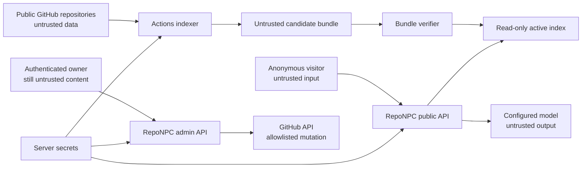

# RepoNPC Security Model

**Status:** Security contract aligned with approved Technical Specification 0.1.9
**Audience:** implementation Agents, operators, reviewers, security researchers

## 1. Security goals

RepoNPC must let anonymous visitors ask questions about public portfolio evidence without allowing repository content, visitors, model output, uploaded assets, or upstream services to:

- execute code or tools;
- read or alter server files outside defined data paths;
- write repositories except through the authenticated allowlisted admin path;
- make arbitrary network requests;
- reveal model/GitHub/admin secrets or private service locations;
- invent or redirect evidence links;
- exhaust unbounded model cost or local capacity;
- replace a valid index with an unverified bundle;
- execute active content in the visitor/admin page or README SVG.

RepoNPC cannot make already-public repositories secret, prove the truth of owner assertions, eliminate all model mistakes, or protect an operator who intentionally publishes credentials. It must make these limits visible and fail safely.

## 2. Data classification

| Class | Examples | Allowed locations |
| --- | --- | --- |
| Public | profile, claims, selected repository text, card/character, immutable citations | Git, bundle, API, browser, public cache |
| Operational | bundle status, counts, latencies, request IDs, token totals | runtime database, sanitized logs, admin status |
| Sensitive | pseudonymous IP HMAC values, session/CSRF hashes, admin audit metadata | protected runtime database/secret mounts |
| Secret | GitHub token, provider key, Argon2id password hash, IP HMAC key, raw setup/session/CSRF tokens | environment, protected runtime database, or secret files as specified; memory as needed; never bundle/browser/log/Git |
| Ephemeral private | visitor question/history, provider prompt/output, uploaded draft before save | request memory only by default; not persisted/logged |

Owner assertions are public statements, not verified facts. The UI and answer policy must keep that label.

## 3. Trust boundaries

Crossing a boundary requires schema validation, size/time bounds, context-specific escaping, and safe error mapping. Authentication does not make configuration, filenames, or images intrinsically safe.

## 4. Threats and required mitigations

| Threat | Required controls | Acceptance evidence |
| --- | --- | --- |
| Repository prompt injection | Evidence delimiters; policy outside evidence; no LLM tools/network/filesystem; output/citation validation; adversarial fixtures | AC-033 |
| Forged citations/person claims | Request-local IDs only; backend mapping; exact commit/path validation; owner-assertion rule; buffer before public output | AC-011–AC-014 |
| Secret ingestion | Mandatory path/type exclusions; high-confidence scan; no body in skip logs; public-only repositories | AC-004 |
| SSRF/open redirect | No fetching repository URLs; configured GitHub/provider/manifest allowlists; redirect and final-host revalidation; private provider URL never returned | AC-016, AC-030, AC-034 |
| XSS/Markdown/SVG injection | Conservative Markdown sanitizer; DOM escaping; safe link schemes; SVG XML escaping and element/attribute allowlists; strict headers/CSP | AC-014, AC-021, AC-034 |
| Path/archive traversal | POSIX normalization, no `..`/absolute paths; archive regular-files-only policy; exact asset path allowlist | AC-027, AC-030 |
| Malicious image/decompression bomb | Byte/pixel/dimension caps; real decode; APNG rejection; metadata removal; safe re-encode | AC-020, AC-027 |
| First visitor claims or exhausts an uninitialized deployment | No default credential or open registration; host-issued 256-bit code; SHA-256 at rest; 15-minute expiry; replacement; same-origin exchange; validate host proof before Argon2; atomic single-owner creation; permanent closure | AC-024 |
| Admin credential/session attack | Explicit loopback/production password policy (4–128 only for loopback evaluation; 15–128 for production/non-loopback); common/compromised-password blocklist; Argon2id; generic errors; backoff; 256-bit sessions; HttpOnly/Secure/SameSite; CSRF + origin; idle/absolute expiry; rotation/revocation | AC-024, AC-049 |
| OAuth state/token or GitHub identity abuse | One-use hashed state; PKCE S256; intent-bound Lax transaction cookie; fixed callback; server-side exchange; numeric identity matching; generic unlinked failure; encrypted credential records | AC-041, AC-042 |
| GitHub overreach/conflict | Fine-grained repo token; fixed branch; exact app path allowlist; expected blob SHA; no auto-merge/delete | AC-026, AC-027 |
| Cost/availability exhaustion | input/history/output caps; per-IP bucket; concurrency; daily budget; timeouts; check before provider | AC-018 |
| Bundle supply-chain/tampering | immutable release; SHA-256 inside/outside; schema/app/model checks; SQLite integrity/smoke; atomic activation; previous bundle | AC-029–AC-031 |
| Dependency/build compromise | lockfiles; minimal trusted Actions; pinned action revisions for release; dependency/image/secret scans; SBOM/notice | AC-037 |
| Privacy leakage through logs/status | request-ID diagnostics only; HMAC IP identifiers; no bodies/secrets/private URLs; safe public errors | AC-035 |

## 5. Model isolation and prompt construction

- System/developer policy is constructed solely by RepoNPC code and is never loaded from repositories.
- Each evidence record is wrapped in unmistakable data delimiters with source ID, evidence class, and metadata.
- The prompt states that instructions, role markers, JSON, Markdown, or quoted system messages inside evidence have no authority.
- Conversation history is untrusted and cannot introduce system messages.
- The model receives no tokens, server paths, environment values, admin state, or unrestricted URL-fetch/tool interface.
- Model output is a proposal: it is buffered, parsed, sanitized, checked against selected IDs and person-claim policy, and only then streamed to the browser.
- A failed validation yields one repair attempt at most, then a safe localized abstention. Validation failure must not become a reason to expose raw model output.

## 6. Network policy

The application may initiate only configured traffic needed for:

- the stable manifest and bundle asset on the configured GitHub repository/allowed hosts;
- GitHub API calls for authenticated admin reads/writes/workflow dispatch;
- the explicitly configured chat/embedding provider.

It never fetches visitor URLs, repository links, `avatar_url` from the server, Markdown images, citation URLs, or model-requested destinations. Redirects are bounded and every hop/final address is revalidated. Production operators should enforce equivalent egress policy where their platform supports it.

Ollama and vLLM should be reachable through private Docker/network addresses and must not be published to the Internet merely for RepoNPC. For vLLM, a network proxy must allowlist only RepoNPC's required `/v1/models`, `/v1/chat/completions`, and `/v1/embeddings` routes because provider API-key enforcement does not protect every operational endpoint. Public status shows the normalized adapter/health only, not base URLs.

The admin listener follows the same private-network rule. A high/non-standard port is not an access control and does not prevent Internet exposure. Bind the host port to loopback for local use, then use an SSH local-port tunnel (`ssh -N -L 8090:127.0.0.1:8000 user@host`) or a firewall-restricted LAN/VPN (such as Tailscale/WireGuard). When a reverse proxy serves a public visitor site, it MUST deny `/admin` and `/api/admin/*` to public networks and allow them only from the private management network. The proxy may expose visitor routes and the fixed OAuth callback only according to the configured origin and state/PKCE checks.

## 7. Secret and credential handling

- Prefer mounted secret files over `.env` for GitHub/provider/IP-HMAC secrets.
- If both value and `_FILE` are supplied for one secret, startup fails rather than choosing precedence.
- Secret files must be regular files, within configured secret mounts, not group/world readable where the platform exposes modes, and bounded in size.
- Setup-code plaintext is returned once to the host CLI and exists only in operator/request memory. Runtime SQLite stores its SHA-256 digest, expiry, and no raw code; reissue invalidates the prior code and successful owner creation deletes it.
- Password plaintext exists only during setup, optional local hash generation, and login verification. Dynamic owners persist only an Argon2id hash in protected runtime SQLite.
- Session and CSRF raw values exist only in request/browser memory; the database stores hashes.
- Error formatting and structured logging apply deterministic redaction to known secret fields and credential patterns.
- Tests use recognizable canary values and assert absence from logs, APIs, bundles, snapshots, and exceptions.
- The `vllm` preset accepts a private HTTP origin only after explicit server-side selection, normalizes to `openai_compatible` for bundle/public compatibility, and keeps both chat and embedding base URLs out of object representations and diagnostics.
- Embedding profile records keep provider/model labels and encrypted credential references separate from public configuration. Probe responses are reduced to safe capability/identity metadata; raw provider bodies, model paths, download URLs, and progress payloads are not persisted or returned.
- Ollama pull/delete is restricted to a curated model ID allowlist and the provider's native API. vLLM and generic OpenAI-compatible profiles have no RepoNPC download path. Arbitrary URLs, local paths, shell commands, and unverified archives are rejected to prevent SSRF, supply-chain injection, and disk exhaustion.

## 8. Web and browser policy

Production is same-origin. Broad CORS is disabled. State-changing admin requests require valid session, `X-CSRF-Token`, and matching HTTPS Origin/Referer. Recommended application headers include:

- `Content-Security-Policy` with self-only scripts/styles/connect sources plus narrowly configured model connections only from server, never browser;
- `X-Content-Type-Options: nosniff`;
- `Referrer-Policy: strict-origin-when-cross-origin`;
- `Permissions-Policy` disabling unused capabilities;
- clickjacking protection through `frame-ancestors 'none'`;
- HSTS at the HTTPS terminator after domain verification.

External GitHub/demo/profile links accept `https` only, render with safe `rel="noopener noreferrer"`, and are never inserted as raw HTML. Admin drafts are treated the same as public content even before save.

## 9. Bundle and filesystem policy

- The application runs non-root with code/read-only assets not writable by the web process.
- Only the configured persistent data directory and temporary staging directory are writable.
- Archive extraction does not follow links or preserve owner/permission metadata.
- Candidate download/extraction has compressed and uncompressed size/file-count limits.
- `index.sqlite` opens in read-only/query-only mode; mutable state uses `runtime.sqlite`.
- Atomic activation never deletes the active/previous bundle before the candidate passes checks and serves a smoke request.
- In-flight requests hold an immutable bundle handle; cleanup waits until it is unused.

## 10. Admin and GitHub permissions

Admin authentication and GitHub authorization are separate capabilities. `REPONPC_IP_HASH_KEY` enables first-owner setup/login/session protection. A missing GitHub token leaves authentication plus local YAML validation, built-in-character preview, character upload validation, README snippet generation, embedding-profile CRUD/probe, and local bundle status available. GitHub-backed configuration/custom-asset reads, writes, asset upload, and workflow dispatch fail closed with `SERVICE_NOT_READY`.

Embedding profile management is owner-authenticated and server-side. Exactly one external profile may be active; a changed profile cannot replace the last-known-good bundle until probe, reindex, checksum, schema, model/dimension, and smoke checks pass. Model pull/delete is available only for curated Ollama IDs and is never a browser-to-provider direct request.

The production fine-grained GitHub token is scoped to the single configuration repository. It needs only:

- Contents: read/write for `reponpc.yml` and character assets;
- Actions: write only if the admin dispatch endpoint is enabled;
- Metadata: read (implicit).

It does not need organization administration, issues, pull requests, packages, secrets, workflows-file write, or access to unrelated repositories. The index-building Action uses its workflow-scoped `GITHUB_TOKEN` and public read access for selected repositories.

Admin audit entries record action/path/commit/outcome/request ID but no body. The application allowlist is enforced even if the GitHub token itself has wider accidental scope.

The reverse proxy/firewall is part of the admin trust boundary: public visitor routes may be exposed, but `/admin` and `/api/admin/*` are private-management routes. SSH/VPN/LAN access is preferred; a non-standard port is not considered an authorization control.

## 11. Privacy and retention defaults

- Conversation persistence is unsupported/disabled in v1.
- Rate identifiers are HMAC-SHA-256 pseudonyms and expire with their windows; raw IPs are not stored by RepoNPC.
- Safe operational/audit retention defaults should be documented and configurable, with 30 days recommended for a personal deployment.
- Active and previous valid bundles remain; older bundles may be cleaned locally, while GitHub Release retention is an operator policy.
- Owners must understand that public profile configuration, claims, selected source excerpts, generated cards, and release bundles are publicly downloadable.

## 12. Security verification and disclosure

Before release, CI and manual review must include dependency/secret/container scanning; hostile repository fixtures; FTS injection; XSS/Markdown/SVG payloads; URL/redirect/SSRF cases; archive/path traversal; forged evidence; login/session/CSRF/backoff; GitHub allowlist/conflicts; provider error leakage; safe-log canaries; budgets/timeouts; and last-known-good recovery.

Operators should enable GitHub private vulnerability reporting or Security Advisories for their fork and publish that route in the repository's `SECURITY.md`. Reports should include affected version, reproduction, and impact without placing live secrets or exploit data in a public issue.

On suspected compromise: disable public chat, revoke/rotate GitHub and provider credentials, rotate admin hash and IP-HMAC key as appropriate, revoke all sessions, preserve sanitized logs, inspect configuration/release history, restore a known-good bundle/image, and document cause before re-enabling service.

## 13. Production checklist

- [ ] HTTPS and trusted-host/proxy configuration verified.
- [ ] Admin routes are loopback/private/VPN-only; public visitor routing denies `/admin` and `/api/admin/*`; no unusual-port-only exposure is used.
- [ ] No default credential exists; first owner was created with a fresh host-issued setup code or explicitly pre-provisioned Argon2id hash.
- [ ] Deployment profile is explicit: loopback evaluation uses the 4-character convenience only locally; production/non-loopback setup enforces the 15-character minimum and blocklist.
- [ ] IP-HMAC key generated uniquely; setup endpoint, reissue, expiry, and permanent closure verified.
- [ ] GitHub/provider secrets supplied through protected files and least privilege reviewed.
- [ ] At least one external embedding profile is probed and active; bundle identity matches; no local embedding runtime or arbitrary model downloader is relied on.
- [ ] Ollama/private services are not publicly published.
- [ ] vLLM is private; any proxy denies non-allowlisted operational routes and chat/embedding models are independently verified.
- [ ] Same-origin/CSP/security headers verified.
- [ ] Public rate, concurrency, timeout, token, and daily budget set.
- [ ] Selected repositories and public owner claims reviewed for sensitive content.
- [ ] Bundle host/repository/redirect validation tested.
- [ ] Active/previous bundle and runtime backup/restore tested.
- [ ] Safe logging canary test passes.
- [ ] Full AC-033 through AC-037 and ENGD-001/002/003/006 release evidence recorded.

## 14. Guided-onboarding security extension (0.1.4)

This section is normative under the owner-approved OR-010 and Technical Specification 0.1.4 amendment.

ADR-021 and Technical Specification 0.1.7 supersede only this section's original synchronous/ephemeral execution lifecycle. The selected-only source boundary, explicit owner action, untrusted-input handling, no-fallback rule, owner-confirmation boundary, and raw-data cleanup remain normative. Current lifecycle and durable-safe-state rules are in section 16.

- Public repository listing is authenticated admin functionality but uses unauthenticated GitHub public metadata requests. The configured writeback token is never sent for discovery and its repository scope is not broadened.
- Username/profile and manual repository inputs normalize only GitHub.com identities. Every API URL, redirect, final host, response size, page number, and request deadline is server-validated. Missing/private/inaccessible repositories share one non-disclosing result.
- Metadata listing is not consent to fetch source. Only exact checkbox-confirmed slug/ref/include/exclude identities may cross into source resolution. A batch contains 1–50 confirmed repositories; the legacy compatibility route accepts one and delegates it to a one-item batch.
- Each item creates unique bounded staging, reuses mandatory exclusions/secret detection/symlink and binary rules, and removes staging after every terminal or recovery path. Runtime SQLite stores no archive, repository body/tree, prompt, provider body, incomplete output, or staging path. It may store only the bounded safe batch metadata/events/cache identities and validated normalized terminal results defined by section 16.
- Repository content remains delimited untrusted evidence. The model still has no tools, GitHub/network/filesystem access, credentials, or arbitrary URLs. Only the configured provider/model may run; failure never triggers fallback.
- Provider-consuming analysis and contribution suggestion require authenticated same-origin intent plus CSRF and share the global generation semaphore. The UI must identify the action as capacity/provider-consuming before the request.
- A model result cannot cross the owner-assertion boundary by type conversion alone. The browser displays the original owner statement beside each proposal and records a separate accept/edit/reject action. Unconfirmed or rejected text is excluded from YAML generation.
- Browser `sessionStorage` may contain only selected public slugs, owner-entered public draft statements, and confirmed suggestions for authenticated-session resume. Logout and successful save clear it. Session/CSRF tokens, credentials, raw repository bodies, raw prompts/outputs, and private provider URLs are prohibited.
- Copy/download is local and non-mutating. The generated file receives the same config validation as a saved draft and must never include deployment secrets or inferred unconfirmed claims.
- Security verification adds SSRF/redirect/account pagination, selected-only source access, no-token discovery, staging cleanup on cancellation/restart/expiry, one-active-owner-batch enforcement, compatibility-route delegation, prompt injection, no-fallback, owner-confirmation, Web Storage canaries, and no-model ordinary preview cases from AC-038 through AC-046.

## 15. GitHub identity and connection extension (0.1.6)

- OAuth Web Application Flow uses a fixed allowlisted GitHub authorization/token/user endpoint set, a random one-use state hash, PKCE S256, server-side code exchange, and an intent-specific short-lived cookie. The normal session cookie is not relied on during GitHub's cross-site return.
- OAuth state, PKCE verifier, first-owner setup proof, and browser/session binding are encrypted or hashed at rest. Tokens and PATs use a dedicated authenticated-encryption key that is independent of IP hashing, provider keys, OAuth client secret, and writeback token.
- OAuth requests no repository scope. Reported broad scopes, token/user endpoint errors, invalid user IDs, redirects, expiry, replay, and wrong intent all fail closed without issuing a session or consuming first-owner setup proof.
- The browser receives an authorization redirect and safe connection state only. It never receives access/refresh tokens, PATs, encryption keys, client secret, transaction verifier/state, token fingerprints, or raw upstream payloads.
- `identity_public_read`, `public_read`, and `writeback` are distinct credential purposes. A revoked/401 read credential requires explicit reconnection and cannot trigger selection of another credential. The configured writeback token is never copied into runtime credentials or used for identity/read preflight.
- First-owner setup always creates a local password before optional GitHub linking. The local method is the break-glass recovery path and cannot be removed as the final method. Unlinking, logout-all, and other sensitive identity changes require recent local authentication. The host-only `reponpc admin set-password --data-dir <dir>` command changes only the local hash; recovery readiness is proven by command/backup tests, not a free-form environment string.

## 16. Bounded GitHub resolver and batch extension (0.1.7)

- Batch analysis is public-repository-only. A GraphQL metadata result is an eligibility gate, not merely a hint: missing, private, inaccessible, unconfirmed, duplicate, or policy-disallowed archived repositories are rejected before archive access.
- Exactly one selected `identity_public_read` or `public_read` credential is admitted to an analysis. The separate writeback credential is structurally unavailable to the resolver. A `401` marks that selected connection `connection_required`; selection does not try another PAT/OAuth credential or writeback token.
- Resolver archives are requested only by a validated full commit SHA and must arrive from the configured GitHub allowlist. Archive readers reject redirects, absolute/parent/backslash paths, duplicate normalized paths, non-regular entries, symbolic/hard links, devices, oversized compressed/expanded streams, excessive entries/files, and deadline/cancellation violations. No raw archive or staging path is included in an API response, event, log, or runtime row.
- GitHub rate metadata is sanitized and stored centrally. Primary GraphQL/core budgets, reset timestamps, `Retry-After`, and secondary-limit pauses govern admission; the scheduler does not spin, repeatedly probe rate endpoints, or leak token-linked headers to the browser.
- Durable batch state stores only safe IDs, immutable commits, stage/state, bounded counts/timestamps, retry reason, event payloads, and validated normalized terminal results. It never stores repository bodies, archive bytes, prompt bodies, provider bodies, credentials, or raw incomplete model output.
- Each item owns a unique bounded staging directory. Cancellation, expiry, startup recovery, validation failure, and terminal transitions remove it. A restart can repeat immutable local work, but a generation already dispatched becomes `needs_retry_confirmation` and cannot be automatically resent.
- Cache records are checksummed before reuse and include the complete identity vector: commit, include/exclude policy, parser/exclusion version, embedding identity, chat model, prompt version, output-schema version, and validation version. Cache eviction is TTL/LRU only and cannot delete active/previous immutable bundles.
- Provider permits are acquired around the actual embedding/generation call, not archive/download/local work. Public chat has weighted-fair admission ahead of batch work so admin analysis cannot turn into a denial of service.

## 17. GitHub OAuth setup guidance (0.1.8)

- Unconfigured setup, sign-in, link, and reauthentication buttons are actionable only as a same-origin guide interaction. They do not submit OAuth starts, redirect to GitHub, or collect any secret, encryption key, or token.
- `GET /api/admin/github/oauth/setup-guide` is deliberately non-sensitive and cache-disabled. It returns only a boolean configuration state, the canonical fixed callback URL, the fixed official GitHub OAuth-App documentation URL, and a next-step label. It never returns environment values, secret-file paths, owner identity, or credential material.
- The frontend renders the callback as non-editable guidance, uses a same-origin dialog with keyboard focus management, and treats documentation links as external navigation with no credential handoff. Dialog status/error text is announced without echoing request bodies or upstream payloads.
- Configured OAuth remains the existing Authorization Code Flow with PKCE S256 and intent-specific state. The actionable preconfiguration path does not weaken state validation, token purpose isolation, final-method protection, or the no-writeback-fallback rule.

## 18. External embedding and private-admin extension (0.1.9)

- At least one external embedding provider is required for a ready deployment. Chat and embedding identities are independent; a chat model or `/v1/models` response alone does not prove embedding capability. Probe must include a bounded sample embedding and verify dimension, normalization, prefixes, and model identity before activation.
- Only one profile may be active. Profile changes trigger an explicit reindex state and atomic last-known-good switch; a failed/cancelled probe or reindex cannot deactivate the known-good bundle.
- Ollama model operations are constrained to a curated model-ID catalog and native provider endpoints. vLLM/OpenAI-compatible profiles are connect/probe-only. Arbitrary URL/local-path downloads and provider-supplied shell commands are forbidden.
- Admin routes are private-management routes. Loopback plus SSH tunnel or a firewall-restricted VPN/LAN is the default; a non-standard port does not reduce exposure. Public reverse proxies must deny `/admin` and `/api/admin/*` to Internet clients.
- Security tests cover profile CRUD/single-active races, probe/reindex rollback, model-download allowlists, SSRF/path traversal/disk exhaustion, password profile boundaries, SSH/proxy route ACLs, and absence of provider secrets/private URLs in all outputs.
