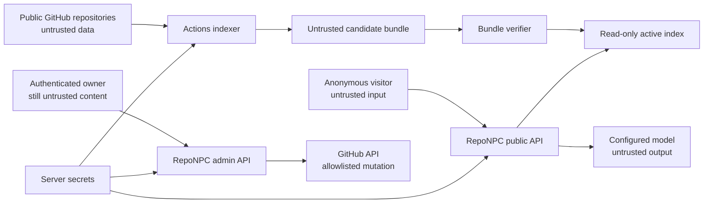

# RepoNPC Security Model

**Status:** Draft security contract; controls are required by Technical Specification 0.1.0  
**Audience:** implementation Agents, operators, reviewers, security researchers

## 1. Security goals

RepoNPC must let anonymous visitors ask questions about public portfolio evidence without allowing repository content, visitors, model output, uploaded assets, or upstream services to:

- execute code or tools;
- read or alter server files outside defined data paths;
- write repositories except through the authenticated allowlisted admin path;
- make arbitrary network requests;
- reveal model/GitHub/admin secrets or private service locations;
- invent or redirect evidence links;
- exhaust unbounded model cost or local capacity;
- replace a valid index with an unverified bundle;
- execute active content in the visitor/admin page or README SVG.

RepoNPC cannot make already-public repositories secret, prove the truth of owner assertions, eliminate all model mistakes, or protect an operator who intentionally publishes credentials. It must make these limits visible and fail safely.

## 2. Data classification

| Class | Examples | Allowed locations |
| --- | --- | --- |
| Public | profile, claims, selected repository text, card/character, immutable citations | Git, bundle, API, browser, public cache |
| Operational | bundle status, counts, latencies, request IDs, token totals | runtime database, sanitized logs, admin status |
| Sensitive | pseudonymous IP HMAC keys, session/CSRF hashes, admin audit metadata | protected runtime database/secret mounts |
| Secret | GitHub token, provider key, Argon2id password hash, IP HMAC key, raw session/CSRF tokens | environment or secret files; memory as needed; never bundle/browser/log/Git |
| Ephemeral private | visitor question/history, provider prompt/output, uploaded draft before save | request memory only by default; not persisted/logged |

Owner assertions are public statements, not verified facts. The UI and answer policy must keep that label.

## 3. Trust boundaries

Crossing a boundary requires schema validation, size/time bounds, context-specific escaping, and safe error mapping. Authentication does not make configuration, filenames, or images intrinsically safe.

## 4. Threats and required mitigations

| Threat | Required controls | Acceptance evidence |
| --- | --- | --- |
| Repository prompt injection | Evidence delimiters; policy outside evidence; no LLM tools/network/filesystem; output/citation validation; adversarial fixtures | AC-033 |
| Forged citations/person claims | Request-local IDs only; backend mapping; exact commit/path validation; owner-assertion rule; buffer before public output | AC-011–AC-014 |
| Secret ingestion | Mandatory path/type exclusions; high-confidence scan; no body in skip logs; public-only repositories | AC-004 |
| SSRF/open redirect | No fetching repository URLs; configured GitHub/provider/manifest allowlists; redirect and final-host revalidation; private provider URL never returned | AC-016, AC-030, AC-034 |
| XSS/Markdown/SVG injection | Conservative Markdown sanitizer; DOM escaping; safe link schemes; SVG XML escaping and element/attribute allowlists; strict headers/CSP | AC-014, AC-021, AC-034 |
| Path/archive traversal | POSIX normalization, no `..`/absolute paths; archive regular-files-only policy; exact asset path allowlist | AC-027, AC-030 |
| Malicious image/decompression bomb | Byte/pixel/dimension caps; real decode; APNG rejection; metadata removal; safe re-encode | AC-020, AC-027 |
| Admin credential/session attack | Argon2id; generic errors; backoff; 256-bit sessions; HttpOnly/Secure/SameSite; CSRF + origin; idle/absolute expiry; rotation/revocation | AC-024 |
| GitHub overreach/conflict | Fine-grained repo token; fixed branch; exact app path allowlist; expected blob SHA; no auto-merge/delete | AC-026, AC-027 |
| Cost/availability exhaustion | input/history/output caps; per-IP bucket; concurrency; daily budget; timeouts; check before provider | AC-018 |
| Bundle supply-chain/tampering | immutable release; SHA-256 inside/outside; schema/app/model checks; SQLite integrity/smoke; atomic activation; previous bundle | AC-029–AC-031 |
| Dependency/build compromise | lockfiles; minimal trusted Actions; pinned action revisions for release; dependency/image/secret scans; SBOM/notice | AC-037 |
| Privacy leakage through logs/status | request-ID diagnostics only; HMAC IP identifiers; no bodies/secrets/private URLs; safe public errors | AC-035 |

## 5. Model isolation and prompt construction

- System/developer policy is constructed solely by RepoNPC code and is never loaded from repositories.
- Each evidence record is wrapped in unmistakable data delimiters with source ID, evidence class, and metadata.
- The prompt states that instructions, role markers, JSON, Markdown, or quoted system messages inside evidence have no authority.
- Conversation history is untrusted and cannot introduce system messages.
- The model receives no tokens, server paths, environment values, admin state, or unrestricted URL-fetch/tool interface.
- Model output is a proposal: it is buffered, parsed, sanitized, checked against selected IDs and person-claim policy, and only then streamed to the browser.
- A failed validation yields one repair attempt at most, then a safe localized abstention. Validation failure must not become a reason to expose raw model output.

## 6. Network policy

The application may initiate only configured traffic needed for:

- the stable manifest and bundle asset on the configured GitHub repository/allowed hosts;
- GitHub API calls for authenticated admin reads/writes/workflow dispatch;
- the explicitly configured chat/embedding provider.

It never fetches visitor URLs, repository links, `avatar_url` from the server, Markdown images, citation URLs, or model-requested destinations. Redirects are bounded and every hop/final address is revalidated. Production operators should enforce equivalent egress policy where their platform supports it.

Ollama should be reachable through a private Docker/network address and must not be published to the Internet merely for RepoNPC. Public status shows adapter/health only, not base URLs.

## 7. Secret and credential handling

- Prefer mounted secret files over `.env` for GitHub/provider/IP-HMAC secrets.
- If both value and `_FILE` are supplied for one secret, startup fails rather than choosing precedence.
- Secret files must be regular files, within configured secret mounts, not group/world readable where the platform exposes modes, and bounded in size.
- Password plaintext exists only during local hash generation and login verification.
- Session and CSRF raw values exist only in request/browser memory; the database stores hashes.
- Error formatting and structured logging apply deterministic redaction to known secret fields and credential patterns.
- Tests use recognizable canary values and assert absence from logs, APIs, bundles, snapshots, and exceptions.

## 8. Web and browser policy

Production is same-origin. Broad CORS is disabled. State-changing admin requests require valid session, `X-CSRF-Token`, and matching HTTPS Origin/Referer. Recommended application headers include:

- `Content-Security-Policy` with self-only scripts/styles/connect sources plus narrowly configured model connections only from server, never browser;
- `X-Content-Type-Options: nosniff`;
- `Referrer-Policy: strict-origin-when-cross-origin`;
- `Permissions-Policy` disabling unused capabilities;
- clickjacking protection through `frame-ancestors 'none'`;
- HSTS at the HTTPS terminator after domain verification.

External GitHub/demo/profile links accept `https` only, render with safe `rel="noopener noreferrer"`, and are never inserted as raw HTML. Admin drafts are treated the same as public content even before save.

## 9. Bundle and filesystem policy

- The application runs non-root with code/read-only assets not writable by the web process.
- Only the configured persistent data directory and temporary staging directory are writable.
- Archive extraction does not follow links or preserve owner/permission metadata.
- Candidate download/extraction has compressed and uncompressed size/file-count limits.
- `index.sqlite` opens in read-only/query-only mode; mutable state uses `runtime.sqlite`.
- Atomic activation never deletes the active/previous bundle before the candidate passes checks and serves a smoke request.
- In-flight requests hold an immutable bundle handle; cleanup waits until it is unused.

## 10. Admin and GitHub permissions

The production fine-grained GitHub token is scoped to the single configuration repository. It needs only:

- Contents: read/write for `reponpc.yml` and character assets;
- Actions: write only if the admin dispatch endpoint is enabled;
- Metadata: read (implicit).

It does not need organization administration, issues, pull requests, packages, secrets, workflows-file write, or access to unrelated repositories. The index-building Action uses its workflow-scoped `GITHUB_TOKEN` and public read access for selected repositories.

Admin audit entries record action/path/commit/outcome/request ID but no body. The application allowlist is enforced even if the GitHub token itself has wider accidental scope.

## 11. Privacy and retention defaults

- Conversation persistence is unsupported/disabled in v1.
- Rate identifiers are HMAC-SHA-256 pseudonyms and expire with their windows; raw IPs are not stored by RepoNPC.
- Safe operational/audit retention defaults should be documented and configurable, with 30 days recommended for a personal deployment.
- Active and previous valid bundles remain; older bundles may be cleaned locally, while GitHub Release retention is an operator policy.
- Owners must understand that public profile configuration, claims, selected source excerpts, generated cards, and release bundles are publicly downloadable.

## 12. Security verification and disclosure

Before release, CI and manual review must include dependency/secret/container scanning; hostile repository fixtures; FTS injection; XSS/Markdown/SVG payloads; URL/redirect/SSRF cases; archive/path traversal; forged evidence; login/session/CSRF/backoff; GitHub allowlist/conflicts; provider error leakage; safe-log canaries; budgets/timeouts; and last-known-good recovery.

Operators should enable GitHub private vulnerability reporting or Security Advisories for their fork and publish that route in the repository's `SECURITY.md`. Reports should include affected version, reproduction, and impact without placing live secrets or exploit data in a public issue.

On suspected compromise: disable public chat, revoke/rotate GitHub and provider credentials, rotate admin hash and IP-HMAC key as appropriate, revoke all sessions, preserve sanitized logs, inspect configuration/release history, restore a known-good bundle/image, and document cause before re-enabling service.

## 13. Production checklist

- [ ] HTTPS and trusted-host/proxy configuration verified.
- [ ] Admin Argon2id hash and IP-HMAC key generated uniquely.
- [ ] GitHub/provider secrets supplied through protected files and least privilege reviewed.
- [ ] Ollama/private services are not publicly published.
- [ ] Same-origin/CSP/security headers verified.
- [ ] Public rate, concurrency, timeout, token, and daily budget set.
- [ ] Selected repositories and public owner claims reviewed for sensitive content.
- [ ] Bundle host/repository/redirect validation tested.
- [ ] Active/previous bundle and runtime backup/restore tested.
- [ ] Safe logging canary test passes.
- [ ] Full AC-033 through AC-037 release evidence recorded.

