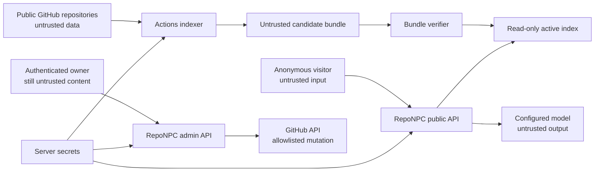

# RepoNPC Security Model

**Owner-approved URL editing exception (2026-09-12, ADR-029; FR-038/040, AC-055/057):** The owner explicitly requested that replacing a managed service URL prefill its saved value. Only `POST /api/admin/model-connections/{connection_id}/edit-endpoint`, guarded by the existing owner session, same-origin check and CSRF, may return `{connection_id, revision, base_url}` with `Cache-Control: no-store`. It accepts no arbitrary URL, reads the exact current encrypted revision, rejects host-managed/unknown connections with 404 and unavailable secret storage with 503, and makes no provider request or mutation. List/detail metadata remains URL-free; API keys, secret references and environment values are never returned. The UI fetches only on the explicit Replace URL action, keeps the result in the active form only, clears it on cancel/toggle-off/teardown, and ignores responses after a form or revision change. Loading disables URL editing/submission; failure permits retry or manual entry. No readback URL may enter browser storage, public drafts, exports, logs or snapshots. This narrow exception supersedes earlier blanket stored-URL readback prohibitions; stored-key prohibitions and destination-change credential rules remain unchanged.

**Owner-approved environment-connection control amendment (2026-09-12, ADR-031; FR-039/040, AC-055/056/057):** Authenticated owners may replace or delete host-managed connection cards. The environment URL/key remain unreadable. Replacement requires a complete new URL and promotes the protected revision to owner-managed; a stored key requires explicit replacement/removal before a destination change, while no-key may remain no-key. Reference-safe deletion persists only a connection ID, `disabled` state, and timestamp so startup cannot recreate the deleted default. Override/suppression state contains no endpoint or credential.

**Owner-approved connection-rebinding amendment (2026-09-13, ADR-032; FR-039/040/042, AC-055/056/057/060):** Effective connection updates rebind only directly referencing editable candidates in the same transaction, clear their old probe evidence, and invalidate affected analysis selection generations. Public-active, previous last-known-good, reindexing, and frozen batch work retain historical revisions. Historical secret rows store only the safe provider label beside encrypted endpoint/key material so pinned work can restore the correct protocol; no endpoint/key becomes readable. Saving does not make a provider request.

**Owner-approved session-resume amendment (2026-09-13, ADR-033; FR-017/029/031, AC-049/050):** An authenticated reload may recover only a still-valid session through empty-body strict same-origin `POST /api/admin/session/resume`. The HttpOnly cookie remains the session credential; the response contains only no-store expiry metadata and a domain-separated session-bound CSRF token held in browser memory. Resume consumes no grant, creates no owner/session, and preserves generic failure, expiry, revocation, Host/Origin, forwarded-header, and deployment-profile controls.

**Owner-approved same-service URL amendment (2026-09-14, ADR-035; FR-039/040, AC-055/057):** Retaining a stored provider key during URL replacement is permitted only when provider plus normalized scheme, case-insensitive hostname, and effective port remain unchanged. Path-only edits such as adding `/v1` stay within that origin. Provider/origin changes still require explicit key replacement/removal. All effective endpoint edits invalidate probe evidence and require explicit retest without automatically contacting the provider. Failed writes preserve existing settings, clear newly typed key text, and return only stable safe errors plus an optional request ID; the initiating form displays one accessible recovery-oriented alert and never exposes secret/private endpoint data.

2026-09-12 novice setup refinement (ADR-029/030, AC-055/058): endpoint retention is an explicit authenticated update intent; URL readback is separate under the owner-approved edit-endpoint exception above. Renaming a service without changing its effective provider/endpoint/key does not rotate credentials or invalidate model tests. ADR-035 clarifies that a same-provider, same-origin path edit may retain the key; provider/origin replacement still forbids implicit transfer. Optional embedding dimensions are discovered only by explicit bounded synthetic query and passage tests; malformed/nonfinite/mismatched samples cannot establish readiness or overwrite a known identity. Runtime migration 19 keeps foreign-key enforcement enabled and rolls back the entire parent/child table rebuild on failure. Installed-model listing is scoped to the selected stored Ollama connection and never accepts arbitrary browser URLs.

Independent fault injection also identified and repaired the existing master-key rotation rollback path: database rollback now runs before its connection closes, and any write failure restores the prior master key before returning `MODEL_SECRET_STORAGE_UNAVAILABLE`. Historical and current encrypted revisions must remain decryptable after failed BEGIN, ciphertext UPDATE, or COMMIT. Synthetic regression probes cover these three failure points; this does not claim crash-atomic file/database rotation across process termination.

**Status:** Security contract aligned with approved Technical Specification 0.3.0; model connection code exists, model-first analysis-selection integration and evidence remain pending
**Audience:** implementation Agents, operators, reviewers, security researchers

## 1. Security goals

RepoNPC must let anonymous visitors ask questions about public portfolio evidence without allowing repository content, visitors, model output, uploaded assets, or upstream services to:

- execute code or tools;
- read or alter server files outside defined data paths;
- write repositories except through the authenticated allowlisted admin path;
- make arbitrary network requests;
- reveal model/GitHub/admin secrets or private service locations;
- invent or redirect evidence links;
- exhaust unbounded model cost or local capacity;
- replace a valid index with an unverified bundle;
- execute active content in the visitor/admin page or README SVG.

RepoNPC cannot make already-public repositories secret, prove the truth of owner assertions, eliminate all model mistakes, or protect an operator who intentionally publishes credentials. It must make these limits visible and fail safely.

## 2. Data classification

| Class | Examples | Allowed locations |
| --- | --- | --- |
| Public | profile, claims, selected repository text, card/character, immutable citations | Git, bundle, API, browser, public cache |
| Operational | bundle status, counts, latencies, request IDs, token totals | runtime database, sanitized logs, admin status |
| Sensitive | pseudonymous IP HMAC values, session/CSRF hashes, admin audit metadata | protected runtime database/secret mounts |
| Secret | GitHub token, provider key, Argon2id password hash, IP HMAC key, raw setup/session/CSRF tokens | environment, protected runtime database, or secret files as specified; memory as needed; never bundle/browser/log/Git |
| Ephemeral private | visitor question/history, provider prompt/output, uploaded draft before save | request memory only by default; not persisted/logged |

Owner assertions are public statements, not verified facts. The UI and answer policy must keep that label.

**0.2.2 ingress exception:** A provider key/private URL newly typed by the authenticated owner may exist transiently in the isolated model form and its same-origin request. Stored keys/private URLs are never returned to the browser. This narrow exception does not authorize browser storage, public export, logging, or direct browser-to-provider calls. Section 21 governs it; the older blanket `never browser` wording means no disclosure of stored secrets.

## 3. Trust boundaries

Crossing a boundary requires schema validation, size/time bounds, context-specific escaping, and safe error mapping. Authentication does not make configuration, filenames, or images intrinsically safe.

## 4. Threats and required mitigations

| Threat | Required controls | Acceptance evidence |
| --- | --- | --- |
| Repository prompt injection | Evidence delimiters; policy outside evidence; no LLM tools/network/filesystem; output/citation validation; adversarial fixtures | AC-033 |
| Forged citations/person claims | Request-local IDs only; backend mapping; exact commit/path validation; owner-assertion rule; buffer before public output | AC-011–AC-014 |
| Secret ingestion | Mandatory path/type exclusions; high-confidence scan; no body in skip logs; public-only repositories | AC-004 |
| SSRF/open redirect | No fetching repository URLs; configured GitHub/provider/manifest allowlists; redirect and final-host revalidation; private provider URL never returned | AC-016, AC-030, AC-034 |
| XSS/Markdown/SVG injection | Conservative Markdown sanitizer; DOM escaping; safe link schemes; SVG XML escaping and element/attribute allowlists; strict headers/CSP | AC-014, AC-021, AC-034 |
| Path/archive traversal | POSIX normalization, no `..`/absolute paths; archive regular-files-only policy; exact asset path allowlist | AC-027, AC-030 |
| Malicious image/decompression bomb | Byte/pixel/dimension caps; real decode; APNG rejection; metadata removal; safe re-encode | AC-020, AC-027 |
| First visitor claims or exhausts an uninitialized deployment | No open registration; loopback uses a host-minted 256-bit fragment-only grant with SHA-256 at rest, two-minute expiry, strict loopback/no-proxy validation, one-use atomic owner/session creation, and relaunch recovery; production retains the 15-minute host setup code and password | AC-024, AC-049 |
| Admin credential/session attack | Loopback host capability or production 15–128-character password; common/compromised-password blocklist and Argon2id in production; generic errors; backoff/rate limit; 256-bit sessions; HttpOnly/Secure/SameSite; CSRF + origin/host; idle/absolute expiry; rotation/revocation | AC-024, AC-049 |
| Localhost attack, DNS rebinding, or accidental remote exposure | Validate deployment profile, bind, public base URL, peer, Host, and Origin as loopback; disable trusted-proxy interpretation; never accept forwarded headers for local launch; refuse unsafe startup; keep grant out of request URL/log/referrer and clear fragment immediately | AC-024, AC-049 |
| OAuth state/token or GitHub connection abuse | Existing authenticated RepoNPC session; one-use hashed state; PKCE S256; connection-intent Lax transaction cookie; fixed callback; server-side exchange; numeric account metadata; encrypted credential records; no owner-session issuance | AC-041, AC-042 |
| GitHub overreach/conflict | Fine-grained repo token; fixed branch; exact app path allowlist; expected blob SHA; no auto-merge/delete | AC-026, AC-027 |
| Cost/availability exhaustion | input/history/output caps; per-IP bucket; concurrency; daily budget; timeouts; check before provider | AC-018 |
| Bundle supply-chain/tampering | immutable release; SHA-256 inside/outside; schema/app/model checks; SQLite integrity/smoke; atomic activation; previous bundle | AC-029–AC-031 |
| Dependency/build compromise | lockfiles; minimal trusted Actions; pinned action revisions for release; dependency/image/secret scans; SBOM/notice | AC-037 |
| Privacy leakage through logs/status | request-ID diagnostics only; HMAC IP identifiers; no bodies/secrets/private URLs; safe public errors | AC-035 |

## 5. Model isolation and prompt construction

- System/developer policy is constructed solely by RepoNPC code and is never loaded from repositories.
- Each evidence record is wrapped in unmistakable data delimiters with source ID, evidence class, and metadata.
- The prompt states that instructions, role markers, JSON, Markdown, or quoted system messages inside evidence have no authority.
- Conversation history is untrusted and cannot introduce system messages.
- The model receives no tokens, server paths, environment values, admin state, or unrestricted URL-fetch/tool interface.
- Model output is a proposal: it is buffered, parsed, sanitized, checked against selected IDs and person-claim policy, and only then streamed to the browser.
- A failed validation yields one repair attempt at most, then a safe localized abstention. Validation failure must not become a reason to expose raw model output.

## 6. Network policy

The application may initiate only configured traffic needed for:

- the stable manifest and bundle asset on the configured GitHub repository/allowed hosts;
- GitHub API calls for authenticated admin reads/writes/workflow dispatch;
- the explicitly configured chat/embedding provider.

It never fetches visitor URLs, repository links, `avatar_url` from the server, Markdown images, citation URLs, or model-requested destinations. Redirects are bounded and every hop/final address is revalidated. Production operators should enforce equivalent egress policy where their platform supports it.

Ollama and vLLM should be reachable through private Docker/network addresses and must not be published to the Internet merely for RepoNPC. For vLLM, a network proxy must allowlist only RepoNPC's required `/v1/models`, `/v1/chat/completions`, and `/v1/embeddings` routes because provider API-key enforcement does not protect every operational endpoint. Public status shows the normalized adapter/health only, not base URLs.

The admin listener follows the same private-network rule. A high/non-standard port is not an access control and does not prevent Internet exposure. Bind the host port to loopback for local use, then use an SSH local-port tunnel (`ssh -N -L 8090:127.0.0.1:8000 user@host`) or a firewall-restricted LAN/VPN (such as Tailscale/WireGuard). When a reverse proxy serves a public visitor site, it MUST deny `/admin` and `/api/admin/*` to public networks and allow them only from the private management network. The proxy may expose visitor routes and the fixed OAuth callback only according to the configured origin and state/PKCE checks.

## 7. Secret and credential handling

- Prefer mounted secret files over `.env` for GitHub/provider/IP-HMAC secrets.
- If both value and `_FILE` are supplied for one secret, startup fails rather than choosing precedence.
- Secret files must be regular files, within configured secret mounts, not group/world readable where the platform exposes modes, and bounded in size.
- Setup-code plaintext is returned once to the host CLI and exists only in operator/request memory. Runtime SQLite stores its SHA-256 digest, expiry, and no raw code; reissue invalidates the prior code and successful owner creation deletes it.
- Password plaintext exists only during setup, optional local hash generation, and login verification. Dynamic owners persist only an Argon2id hash in protected runtime SQLite.
- Session and CSRF raw values exist only in request/browser memory; the database stores hashes.
- Error formatting and structured logging apply deterministic redaction to known secret fields and credential patterns.
- Tests use recognizable canary values and assert absence from logs, APIs, bundles, snapshots, and exceptions.
- The `vllm` preset accepts a private HTTP origin only after explicit server-side selection, normalizes to `openai_compatible` for bundle/public compatibility, and keeps both chat and embedding base URLs out of object representations and diagnostics.
- Embedding profile records keep provider/model labels and encrypted credential references separate from public configuration. Probe responses are reduced to safe capability/identity metadata; raw provider bodies, model paths, download URLs, and progress payloads are not persisted or returned.
- Ollama pull/delete is restricted to a curated model ID allowlist and the provider's native API. vLLM and generic OpenAI-compatible profiles have no RepoNPC download path. Arbitrary URLs, local paths, shell commands, and unverified archives are rejected to prevent SSRF, supply-chain injection, and disk exhaustion.
- Managed model keys may enter only through the protected form in section 21. Their encrypted storage is separate from the retired GitHub OAuth/PAT lifecycle; prefer existing mounted secrets for host-managed configurations.

## 8. Web and browser policy

Production is same-origin. Broad CORS is disabled. State-changing admin requests require valid session, `X-CSRF-Token`, and matching HTTPS Origin/Referer. Recommended application headers include:

- `Content-Security-Policy` with self-only scripts/styles/connect sources plus narrowly configured model connections only from server, never browser;
- `X-Content-Type-Options: nosniff`;
- `Referrer-Policy: strict-origin-when-cross-origin`;
- `Permissions-Policy` disabling unused capabilities;
- clickjacking protection through `frame-ancestors 'none'`;
- HSTS at the HTTPS terminator after domain verification.

External GitHub/demo/profile links accept `https` only, render with safe `rel="noopener noreferrer"`, and are never inserted as raw HTML. Admin drafts are treated the same as public content even before save.

## 9. Bundle and filesystem policy

- The application runs non-root with code/read-only assets not writable by the web process.
- Only the configured persistent data directory and temporary staging directory are writable.
- Archive extraction does not follow links or preserve owner/permission metadata.
- Candidate download/extraction has compressed and uncompressed size/file-count limits.
- `index.sqlite` opens in read-only/query-only mode; mutable state uses `runtime.sqlite`.
- Atomic activation never deletes the active/previous bundle before the candidate passes checks and serves a smoke request.
- In-flight requests hold an immutable bundle handle; cleanup waits until it is unused.

## 10. Admin and GitHub permissions

Admin authentication and GitHub authorization are separate capabilities. In `loopback_evaluation`, possession and successful same-origin exchange of a fresh host-minted local-launch grant creates the normal protected session; production uses setup proof plus a local password. A missing GitHub token or OAuth configuration leaves authentication plus local YAML validation, built-in-character preview, character upload validation, README snippet generation, embedding-profile CRUD/probe, and local bundle status available. Only the affected GitHub-backed operations fail closed with `SERVICE_NOT_READY`.

Embedding profile management is owner-authenticated and server-side. Exactly one external profile may be active; a changed profile cannot replace the last-known-good bundle until probe, reindex, checksum, schema, model/dimension, and smoke checks pass. Model pull/delete is available only for curated Ollama IDs and is never a browser-to-provider direct request.

The production fine-grained GitHub token is scoped to the single configuration repository. It needs only:

- Contents: read/write for `reponpc.yml` and character assets;
- Actions: write only if the admin dispatch endpoint is enabled;
- Metadata: read (implicit).

It does not need organization administration, issues, pull requests, packages, secrets, workflows-file write, or access to unrelated repositories. The index-building Action uses its workflow-scoped `GITHUB_TOKEN` and public read access for selected repositories.

Admin audit entries record action/path/commit/outcome/request ID but no body. The application allowlist is enforced even if the GitHub token itself has wider accidental scope.

The reverse proxy/firewall is part of the admin trust boundary: public visitor routes may be exposed, but `/admin` and `/api/admin/*` are private-management routes. SSH/VPN/LAN access is preferred; a non-standard port is not considered an authorization control.

## 11. Privacy and retention defaults

- Conversation persistence is unsupported/disabled in v1.
- Rate identifiers are HMAC-SHA-256 pseudonyms and expire with their windows; raw IPs are not stored by RepoNPC.
- Safe operational/audit retention defaults should be documented and configurable, with 30 days recommended for a personal deployment.
- Active and previous valid bundles remain; older bundles may be cleaned locally, while GitHub Release retention is an operator policy.
- Owners must understand that public profile configuration, claims, selected source excerpts, generated cards, and release bundles are publicly downloadable.

## 12. Security verification and disclosure

Before release, CI and manual review must include dependency/secret/container scanning; hostile repository fixtures; FTS injection; XSS/Markdown/SVG payloads; URL/redirect/SSRF cases; archive/path traversal; forged evidence; login/session/CSRF/backoff; GitHub allowlist/conflicts; provider error leakage; safe-log canaries; budgets/timeouts; and last-known-good recovery.

Operators should enable GitHub private vulnerability reporting or Security Advisories for their fork and publish that route in the repository's `SECURITY.md`. Reports should include affected version, reproduction, and impact without placing live secrets or exploit data in a public issue.

On suspected compromise: disable public chat, revoke/rotate GitHub and provider credentials, rotate admin hash and IP-HMAC key as appropriate, revoke all sessions, preserve sanitized logs, inspect configuration/release history, restore a known-good bundle/image, and document cause before re-enabling service.

## 13. Production checklist

- [ ] HTTPS and trusted-host/proxy configuration verified.
- [ ] Admin routes are loopback/private/VPN-only; public visitor routing denies `/admin` and `/api/admin/*`; no unusual-port-only exposure is used.
- [ ] No default credential exists; loopback owner access used a fresh two-minute launcher grant, or production owner creation used a fresh host setup code/pre-provisioned Argon2id hash.
- [ ] Deployment profile is explicit: loopback evaluation has only loopback bind/base URL/peer/Host/origin and no trusted proxy; production/non-loopback setup enforces the 15-character minimum and blocklist.
- [ ] IP-HMAC key generated uniquely; profile-appropriate grant/setup issuance, replacement, expiry, replay denial, and atomic sole-owner behavior verified.
- [ ] GitHub/provider secrets supplied through protected files and least privilege reviewed.
- [ ] At least one external embedding profile is probed and active; bundle identity matches; no local embedding runtime or arbitrary model downloader is relied on.
- [ ] Ollama/private services are not publicly published.
- [ ] vLLM is private; any proxy denies non-allowlisted operational routes and chat/embedding models are independently verified.
- [ ] Same-origin/CSP/security headers verified.
- [ ] Public rate, concurrency, timeout, token, and daily budget set.
- [ ] Selected repositories and public owner claims reviewed for sensitive content.
- [ ] Bundle host/repository/redirect validation tested.
- [ ] Active/previous bundle and runtime backup/restore tested.
- [ ] Safe logging canary test passes.
- [ ] Full AC-033 through AC-037 and ENGD-001/002/003/006 release evidence recorded.

## 14. Guided-onboarding security extension (0.1.4)

This section is normative under the owner-approved OR-010 and Technical Specification 0.1.4 amendment.

ADR-021 and Technical Specification 0.1.7 supersede only this section's original synchronous/ephemeral execution lifecycle. The selected-only source boundary, explicit owner action, untrusted-input handling, no-fallback rule, owner-confirmation boundary, and raw-data cleanup remain normative. Current lifecycle and durable-safe-state rules are in section 16.

- Public repository listing is authenticated admin functionality but uses unauthenticated GitHub public metadata requests. The configured writeback token is never sent for discovery and its repository scope is not broadened.
- Username/profile and manual repository inputs normalize only GitHub.com identities. Every API URL, redirect, final host, response size, page number, and request deadline is server-validated. Missing/private/inaccessible repositories share one non-disclosing result.
- Metadata listing is not consent to fetch source. Only exact checkbox-confirmed slug/ref/include/exclude identities may cross into source resolution. A batch contains 1–50 confirmed repositories; the legacy compatibility route accepts one and delegates it to a one-item batch.
- Each item creates unique bounded staging, reuses mandatory exclusions/secret detection/symlink and binary rules, and removes staging after every terminal or recovery path. Runtime SQLite stores no archive, repository body/tree, prompt, provider body, incomplete output, or staging path. It may store only the bounded safe batch metadata/events/cache identities and validated normalized terminal results defined by section 16.
- Failed batch items may additionally retain one application-owned reason from the closed set `NO_ELIGIBLE_CONTENT`, `PROVIDER_OUTPUT_SCHEMA_INVALID`, `PROVIDER_EVIDENCE_ID_INVALID`, `PROVIDER_PERSONAL_INFERENCE_REJECTED`, or `PROVIDER_OUTPUT_LIMIT_REACHED`. These values interpolate no provider text or repository data. Unknown reasons are dropped before persistence; the authenticated no-store snapshot and UI expose only allowlisted code/reason values and fixed bilingual explanations. ADR-034 / migration 24 adds only the fixed output-limit reason, not raw termination metadata or provider text.
- Authenticated repository analysis uses its own positive output policy (default 8,192, hard maximum 16,384), configurable active-work/provider/archive/source ceilings, and shared provider admission. Capacity waits do not spend active work. Transient rate-limit/timeout/unavailable failures may retry only the same frozen provider/model up to three total attempts; authentication, context, validation and output-limit failures do not retry, and fallback remains forbidden. Reserve complete prompt/evidence/ID/schema/framing input together with output before generation. Context shortage fails safely. Visitor chat/probe output is independently bounded at 4,096-default / 8,192-maximum. Reject output-limit termination before parsing and never publish/cache truncated content, even when it forms valid JSON. Analysis cache identity includes the budget and generation/validation policy, preserving incompatible old results only under their old identity. Oversized individual archive files remain body-free and become `FILE_TOO_LARGE` skips; total archive limits, path/type validation and decompression-bomb defenses remain fail-closed.
- Repository content remains delimited untrusted evidence. The model still has no tools, GitHub/network/filesystem access, credentials, or arbitrary URLs. Only the configured provider/model may run; failure never triggers fallback.
- Provider-consuming analysis and contribution suggestion require authenticated same-origin intent plus CSRF and share the global generation semaphore. The UI must identify the action as capacity/provider-consuming before the request.
- A model result cannot cross the owner-assertion boundary by type conversion alone. The browser displays the original owner statement beside each proposal and records a separate accept/edit/reject action. Unconfirmed or rejected text is excluded from YAML generation.
- Browser `sessionStorage` may contain only selected public slugs, owner-entered public draft statements, and confirmed suggestions for authenticated-session resume. Logout and successful save clear it. Session/CSRF tokens, credentials, raw repository bodies, raw prompts/outputs, and private provider URLs are prohibited.
- Copy/download is local and non-mutating. The generated file receives the same config validation as a saved draft and must never include deployment secrets or inferred unconfirmed claims.
- Security verification adds SSRF/redirect/account pagination, selected-only source access, no-token discovery, staging cleanup on cancellation/restart/expiry, one-active-owner-batch enforcement, compatibility-route delegation, prompt injection, no-fallback, owner-confirmation, Web Storage canaries, and no-model ordinary preview cases from AC-038 through AC-046.

## 15. Legacy GitHub identity and connection extension (0.1.6–0.2.0; superseded by 0.2.1)

This section records the migration source. ADR-028 removes these reachable OAuth/PAT behaviors; section 20 is normative for the replacement.

- OAuth Web Application Flow uses a fixed allowlisted GitHub authorization/token/user endpoint set, a random one-use state hash, PKCE S256, server-side code exchange, an existing RepoNPC session binding, and a connection-intent short-lived cookie. The normal session cookie is not the sole proof during GitHub's cross-site return.
- OAuth state, PKCE verifier, local session binding, and connection metadata are encrypted or hashed at rest. Tokens and PATs use a dedicated authenticated-encryption key that is independent of IP hashing, provider keys, OAuth client secret, and writeback token.
- OAuth requests no repository scope. Reported broad scopes, token/user endpoint errors, invalid user IDs, redirects, expiry, replay, wrong intent, missing RepoNPC session, and legacy login/setup starts all fail closed without issuing a session or consuming production setup/local-launch proof.
- The browser receives an authorization redirect and safe connection state only. It never receives access/refresh tokens, PATs, encryption keys, client secret, transaction verifier/state, token fingerprints, or raw upstream payloads.
- `identity_public_read`, `public_read`, and `writeback` are distinct credential purposes. A revoked/401 read credential requires explicit reconnection and cannot trigger selection of another credential. The configured writeback token is never copied into runtime credentials or used for identity/read preflight.
- GitHub is connection-only. It cannot create, authenticate, or recover the RepoNPC owner. Disconnecting it affects only public-read work. Production recovery uses host-only `reponpc admin set-password --data-dir <dir>`; loopback recovery mints a new local-launch grant through the launcher.

## 16. Bounded GitHub resolver and batch extension (0.1.7)

- Batch analysis is public-repository-only. Bounded unauthenticated REST metadata is an eligibility gate, not merely a hint: missing, private, inaccessible, unconfirmed, duplicate, or policy-disallowed archived repositories are rejected before archive access.
- Discovery, resolution, and archive requests carry no OAuth/PAT/writeback authorization. The separate writeback credential is structurally unavailable to the resolver and cannot be selected as a fallback.
- Resolver archives are requested only by a validated full commit SHA. Every redirect and final URL must match the exact allowlisted codeload owner/repository/archive-format/full-SHA identity; unrelated repositories, SHAs, malformed paths, query/fragment/userinfo, hostile hosts, and second redirects fail before body consumption. Archive readers also reject absolute/parent/backslash paths, duplicate normalized paths, non-regular entries, symbolic/hard links, devices, oversized compressed/expanded streams, excessive entries/files, and deadline/cancellation violations. No raw archive or staging path is included in an API response, event, log, or runtime row.
- GitHub rate metadata is sanitized and stored centrally. Anonymous REST/core budgets, reset timestamps, `Retry-After`, and secondary-limit pauses govern admission; the scheduler does not spin, repeatedly probe rate endpoints, or leak upstream headers to the browser.
- Durable batch state and the bounded resolution cache store only safe IDs/metadata, immutable commits, stage/state, bounded counts/timestamps, retry reason, event payloads, expiry, and validated normalized terminal results. They never store repository bodies, archive bytes, prompt bodies, provider bodies, credentials, or raw incomplete model output. Cached exact-SHA resolution permits forward progress across anonymous rate resets without ref drift.
- Each item owns a unique bounded staging directory. Cancellation, expiry, startup recovery, validation failure, and terminal transitions remove it. A restart can repeat immutable local work, but a generation already dispatched becomes `needs_retry_confirmation` and cannot be automatically resent.
- Cache records are checksummed before reuse and include the complete identity vector: commit, include/exclude policy, parser/exclusion version, embedding identity, chat model, prompt version, output-schema version, and validation version. Cache eviction is TTL/LRU only and cannot delete active/previous immutable bundles.
- Provider permits are acquired around the actual embedding/generation call, not archive/download/local work. Public chat has weighted-fair admission ahead of batch work so admin analysis cannot turn into a denial of service.

## 17. Legacy GitHub OAuth setup (0.1.8–0.2.0; removed in 0.2.1)

This historical section is retained only to explain migration scope. OAuth setup, callback, connection, and browser-entered public-read PAT controls are removed; compatibility routes return `410 GITHUB_PUBLIC_READ_CREDENTIALS_REMOVED` and never process credentials.

## 18. External embedding and private-admin extension (0.1.9)

- At least one external embedding provider is required for a ready deployment. Chat and embedding identities are independent; a chat model or `/v1/models` response alone does not prove embedding capability. Probe must include a bounded sample embedding and verify dimension, normalization, prefixes, and model identity before activation.
- Only one profile may be active. Profile changes trigger an explicit reindex state and atomic last-known-good switch; a failed/cancelled probe or reindex cannot deactivate the known-good bundle.
- Ollama model operations are constrained to a curated model-ID catalog and native provider endpoints. vLLM/OpenAI-compatible profiles are connect/probe-only. Arbitrary URL/local-path downloads and provider-supplied shell commands are forbidden.
- Admin routes are private-management routes. Loopback plus SSH tunnel or a firewall-restricted VPN/LAN is the default; a non-standard port does not reduce exposure. Public reverse proxies must deny `/admin` and `/api/admin/*` to Internet clients.
- Security tests cover profile CRUD/single-active races, probe/reindex rollback, model-download allowlists, SSRF/path traversal/disk exhaustion, password profile boundaries, SSH/proxy route ACLs, and absence of provider secrets/private URLs in all outputs.

## 19. Passwordless loopback launch (0.2.0)

- The local launcher creates a random 256-bit grant only after readiness. It stores only a SHA-256 digest, expires it after two minutes, replaces any prior unused grant, and opens it only in the `#local-launch=` fragment. The grant is never placed in a query string, request/access log, cookie, persistent browser storage, diagnostic payload, screenshot, or fixture.
- The frontend exchanges the fragment exactly once through same-origin `POST /api/admin/session/local-launch`, calls `history.replaceState` before rendering any external navigation, and retains only the returned CSRF value in memory. Failed/replayed values are cleared and produce one safe relaunch instruction.
- Without a fragment, the frontend first calls empty-body `POST /api/admin/session/resume`. The endpoint requires the valid HttpOnly cookie and the same strict host/origin/private-admin boundary, returns only `Cache-Control: no-store` CSRF/expiry metadata, and never consumes or recreates a launch grant. The 256-bit pseudorandom CSRF is derived from the session token with a domain-separated server HMAC, so reload can reissue it without browser persistence or invalidating another tab. Existing stored random CSRF remains accepted only for its original session lifetime.
- The backend enables this endpoint only for `loopback_evaluation` after validating loopback bind, loopback public base URL, loopback peer, allowlisted `Host`, same-origin request, and disabled trusted-proxy interpretation. `Forwarded` and `X-Forwarded-*` cannot upgrade a request to local. Any unsafe combination fails startup or returns one generic denial.

## 20. GitHub public-read credential retirement (0.2.1)

- The product accepts no GitHub OAuth authorization code, OAuth token, public-read PAT, client secret, callback configuration, or browser-entered GitHub read credential.
- Legacy OAuth/PAT endpoints are non-redirecting and non-mutating during their bounded `410` compatibility window. They never parse/decrypt credential bodies, issue owner sessions, or disclose whether legacy encrypted state existed.
- Runtime migration deletes OAuth transactions, GitHub connection identities, and `identity_public_read` / `public_read` credential rows without decrypting or logging them. Authentication, local-launch, password, session, draft, bundle, and independent writeback state are preserved transactionally.
- Public discovery and analysis use only fixed-origin unauthenticated REST metadata and immutable-full-SHA archives. Redirect/SSRF, response-size, timeout, path, link, archive-bomb, staging-cleanup, selected-only, and untrusted-content controls remain mandatory.
- No discovery, resolution, preflight, or archive request may contain an authorization header or receive the writeback credential. Tests use writeback-secret canaries across every normal, retry, error, and cancellation path.
- Anonymous primary/secondary rate exhaustion produces only sanitized capacity/retry state, never a credential prompt. Manual authoring, validation, preview, copy, and download remain available immediately.
- Pre-migration backups may contain encrypted legacy records and remain protected by the existing backup-retention and destruction policy.
- Grant consumption, sole-owner creation/reuse, session creation, and competing-grant invalidation are one transaction. The durable owner may have no password in loopback mode. Moving that runtime to production fails readiness until the operator uses the host-only password command.
- Session, CSRF, expiry, rotation, revocation, and safe-audit controls are unchanged. A local logout does not expose a login form; access resumes only through a new launcher grant.

## 21. Owner-managed model connections (0.2.2)

ADR-029 authorizes a write-only provider-key/API-address input on authenticated Web Admin. The owner-approved edit-endpoint exception above permits managed URL readback only; it does not authorize key readback, a network proxy, a public credential form, or a new inference runtime.

ADR-031 makes host-managed cards controllable without disclosing their environment values. The first edit must submit a complete replacement URL; only after that value is stored as owner-managed may the existing edit-endpoint rule read it back. Deletion writes a secret-free durable suppression marker in the same transaction before removing an unreferenced connection. Startup must honor both replacement and suppression instead of importing the environment again.

- Enforce body-size limits, valid session, CSRF, same-origin/private administration and safe validation before any provider call. Public YAML/editor/preview endpoints continue rejecting secrets. Return only server IDs, display labels, configured booleans and sanitized capability/status metadata. No key suffix, fingerprint, previous private URL, raw upstream body or rejected request body is returned.
- A newly entered key is ephemeral form state, cleared after submission and on cancel/logout/expiry/unmount. Do not serialize it or the private address with the guided draft. Disable request-body recording for this boundary; synthetic canaries must prove absence from app/proxy logs, snapshots, traces, browser stores, exports and validation exceptions. Showing a freshly typed key is not permission to fetch a stored key.
- Use vetted authenticated encryption with an independent host-protected key, or an equivalent supported OS secret store. Never store plaintext keys in SQLite or reuse OAuth/PAT encryption settings. Bound stored entries and cleanup unreferenced revisions. Protect encryption keys separately from runtime backups; test permissions, unavailable keys, ciphertext tampering, backup/restore and rotation. Missing protection fails closed while manual work remains possible.
- Connection revisions bind protocol, exact normalized endpoint and credential reference. Historical revision rows retain the provider label as non-secret metadata and keep endpoint/key encrypted. Effective changes atomically rebind only directly referencing inactive candidates that are neither previous last-known-good nor reindexing, clear their old probe evidence, and invalidate affected analysis selection generation; unrelated profiles are untouched. Public-active, previous last-known-good, reindexing and frozen work retain their revision and resolve only its historical provider/secret. Endpoint/protocol replacement requires a fresh credential choice; never probe a changed host/path with a retained secret. The first host-managed replacement may retain a proven absent-key state, while ordinary managed edits keep the explicit key-intent rule. A blank key is not a delete instruction. Explicit no-key authentication is allowed for suitable private services; errors cannot select another key or service. No automatic retest or provider request follows a save.
- Server egress accepts only fixed operations on a validated chosen service. Enforce HTTPS for public endpoints and explicit private-target policy for local/private services. Reject userinfo, query/fragment credentials, traversal, forbidden address classes and metadata endpoints; validate all IPv4/IPv6/DNS resolutions when connecting, constrain transport to those addresses, and reject credential-bearing redirects. Model listing, health, chat, embedding and Ollama operations use the same policy.
- Optional listing never substitutes for bounded synthetic capability tests. Apply provider capacity/time/response limits; test failures cannot cause automatic downloads, repository uploads, reindexes or publication. User-selected destinations receive only the intentionally configured role's requests.
- AC-055/AC-056 cover attack and recovery paths. Retain AC-024/AC-033/AC-035/AC-051/AC-052 to prevent regressions in authentication, evidence isolation, privacy, and GitHub retirement.

Model probe diagnostics (owner correction, 2026-09-12, AC-054/AC-055): validated upstream HTTP status (100–599) or a fixed provider failure category refines authenticated profile `last_error_code`. The owner explicitly requested the original provider error instead of inferred/localized explanations. `last_error_message` is a narrow exception allowing sanitized message text from failed synthetic model probes in the authenticated profile response/runtime row. Follow Technical Specification 11.5's structural extraction and bounds: JSON error/message/detail strings or explicit plain text, at most 65,536 input bytes and 2,000 output characters, configured key/private URL/encoded-value/hostname and URL-span redaction before truncation, and display-control removal. Do not persist or return entire response bodies, metadata, headers, arbitrary exception text, or credentials. HTML pages and unsupported shapes yield no message; accepted text is escaped by React, never rendered as HTML. This parser does not identify arbitrary unknown secrets belonging to a provider; only configured sensitive values and URL spans can be redacted structurally. Message fields are excluded from exception/profile representations and remain behind existing session/same-origin/no-store boundaries; public diagnostics, logs, analysis jobs, exports and bundles do not receive them. Timeout/network errors without an HTTP response must not fabricate one. Successful retest or test-invalidating changes clear old message text.

## 22. Model-first analysis selection (0.2.3)

ADR-030 permits an explicitly selected tested chat/embedding pair to power authenticated owner analysis before public bundle activation. It does not make model setup public, grant the LLM tools, relax source confirmation, or turn temporary analysis data into a published index.

- Analysis readiness is authenticated safe metadata owned by the server. Never trust sessionStorage/local state, model-list presence, `/api/public/status.model.ready`, or a public `active` profile flag as sole authority. Role selections bind server IDs, exact connection revisions, tested model/embedding identity and a selection generation. Read responses remain secret-safe under section 21.
- Merely opening/resuming the wizard, listing metadata, saving a candidate, testing a model or returning from settings cannot fetch repository source or generate analysis. One explicit Start analysis intent enters existing preflight/admission/idempotency controls. Network loss/reload checks the active server job before retry; it must not duplicate provider work.
- The analysis pair is distinct from public-serving state. Selecting/testing it must not mutate public bundle pointers, activate an incompatible profile, start a reindex, publish a temporary derived index or replace last-known-good service. Public visitors continue to use only the verified active bundle/model pair.
- The current analysis algorithm requires both embedding and chat. Use the selected embedding revision for passages/query and selected chat revision for generation. A missing or invalid role fails before source/model work and offers the manual route. Do not introduce lexical/chat-only fallback or select another role/provider automatically.
- Preflight and execution freeze repository selection plus both model revisions. A model/connection/repository change invalidates a stale plan and incompatible cache identity. In-flight work retains the frozen pair or fails safely if its referenced secret/revision cannot be resolved; it never retargets the newest model. Generation interruption retains explicit retry confirmation.
- Reuse global provider admission/fairness and per-provider limits even if implementation separates analysis and public runtimes. Creating a second runtime object must not double the effective generation allowance. Probe and analysis requests retain bounds, synthetic/content separation, redaction, request IDs and no raw upstream persistence.
- Clean startup can have no provider runtime or public bundle. Later authenticated setup must construct analysis dependencies safely in the same process. Avoid callbacks that report selected/active while leaving runtime execution unavailable. Failure preserves connection/profile data, manual drafts and public last-known-good service.
- Browser-state migration preserves only allowed public draft fields and navigation intent. It may record a safe return destination but not capability proof, profile secrets, private endpoints or raw results. Legacy progress cannot cause automatic tests or analysis. Session expiry/logout retains existing clearing controls; newly typed key/URL state is always ephemeral.
- Security regression adds AC-058 through AC-060: clean no-model/no-bundle first analysis, existing-public-A versus analysis-B isolation, stale-plan and rotation races, duplicate Start/reload, old guided-state recovery, secret canaries, and absence of temporary index/provider bodies from runtime rows, logs, exports and bundles.

Chat parse follow-up (2026-09-12): the authenticated `last_error_message` exception also permits fixed application-owned `RepoNPC response check:` diagnostics. `ResponseIssue` is a closed set of parser checks; no response content, reasoning, unknown field name, header, request id value, URL or key is interpolated. They retain the same no-store/authenticated boundaries and clear-on-success semantics. HTTP provider error quotations remain separate and redacted. No public diagnostic or logging expansion is authorized.
